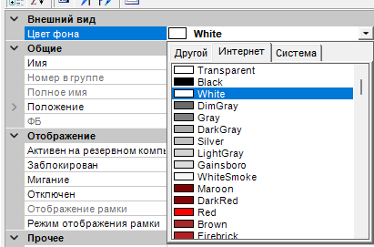

# Зависание UI при установке BackColor = Transparent

## Описание проблемы

При установке свойства `BackColor = Color.Transparent` для `ValveControl`, `PumpControl` (и других контролов, наследующих `VisualControlBase` -> `WinFormsControlBase`) происходит зависание интерфейса MasterSCADA:

- Окно свойств перестает обновляться
- Невозможно выбрать другие элементы
- Невозможно закрыть проект
- В мониторинге производительности видны постоянные всплески нагрузки и работа GC
- При определенном наборе действий удалось сломать проект целиком



## Причина

В базовом классе `MasterSCADA.GUI.WinFormsControlBase` свойство `BackColor` при установке `Color.Transparent` включает стиль окна `WS_EX_TRANSPARENT`:

```csharp
// WinFormsControlBase.cs (декомпилированный)
[DispId(-501)]
public override Color BackColor
{
    get => base.BackColor;
    set
    {
        if (value == Color.Transparent)
        {
            SetStyle(ControlStyles.DoubleBuffer | ControlStyles.OptimizedDoubleBuffer, false);
            SetStyle(ControlStyles.UserPaint | ControlStyles.Opaque | ControlStyles.AllPaintingInWmPaint, true);
            if (IsHandleCreated)
                User32.SetWindowExStyle(Handle, User32.WindowExStyles.WS_EX_TRANSPARENT, true);
        }
        base.BackColor = value;
    }
}

protected override CreateParams CreateParams
{
    get
    {
        CreateParams cp = base.CreateParams;
        if (this.BackColor == Color.Transparent)
            cp.ExStyle |= 32; // WS_EX_TRANSPARENT
        return cp;
    }
}
```

`WS_EX_TRANSPARENT` -- стиль Windows, который требует перерисовки всех окон позади контрола перед его отрисовкой. В сложном UI дизайнера MasterSCADA это вызывает лавину сообщений перерисовки (paint storm).

## Исследованные решения

| Подход | Результат |
|--------|-----------|
| Перехват setter, `return;` без действий | Работает, но прозрачность не применяется |
| Перехват setter, подмена на `Color.FromArgb(1,255,255,255)` | Зависает |
| Перехват setter + override `CreateParams` для очистки `WS_EX_TRANSPARENT` | Зависает |
| Getter возвращает `Color.Transparent` при установленном флаге | Зависает (CreateParams читает getter) |
| Установка backing field через reflection | Контрол не загружается |

**Ключевой вывод:** Если getter свойства `BackColor` возвращает `Color.Transparent`, базовый `CreateParams` устанавливает `WS_EX_TRANSPARENT`, что вызывает зависание. Перехватить это на уровне наследника невозможно без модификации базового класса.

## Текущий workaround

В `ValveControl` и `PumpControl` добавлен перехват, блокирующий установку `Color.Transparent`:

```csharp
public override Color BackColor
{
    get => base.BackColor;
    set
    {
        if (value == Color.Transparent)
            return; // Блокируем — вызывает зависание UI
        base.BackColor = value;
    }
}
```

**Обязательно** применить этот перехват во всех блоках-наследниках `VisualControlBase`. В задачах, требующих прозрачность фона, можно использовать `Visible = off`.

## Возможные решения (требуют изменения WinFormsControlBase)

1. **Не использовать `WS_EX_TRANSPARENT`** -- реализовать прозрачность через `OnPaintBackground` и ручную отрисовку родительского фона.
2. **Добавить виртуальный метод** `protected virtual bool UseNativeTransparency => true`, который наследники могут переопределить.
3. **Проверять контекст** -- не применять `WS_EX_TRANSPARENT` в design-time.

## Окружение

- MasterSCADA 3.12
- .NET Framework 4.8
- `MasterSCADA.Common.dll` (WinFormsControlBase)
- `FB.dll` (VisualControlBase)
