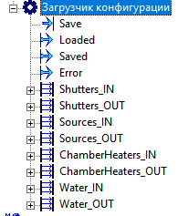

# ConfigLoader -- Загрузчик конфигурации



> **TL;DR:** Загружает и сохраняет имена оборудования (заслонки, источники, нагреватели, вода, газы) из YAML-файла. При старте Runtime читает файл и раздаёт имена по выходным пинам. По команде Save собирает имена с входных пинов, валидирует, записывает в файл и обновляет выходы. Если файла нет -- создаёт пустой автоматически.

---

## 1. Интерфейс

### Входы

| ID | Имя | Тип | Описание |
|----|-----|-----|----------|
| 1 | Save | bool | Фронт `0 -> 1` запускает сохранение |

### Выходы

| ID | Имя | Тип | Описание |
|----|-----|-----|----------|
| 2 | Loaded | bool | `true` если конфигурация успешно загружена |
| 3 | Saved | bool | `true` на 1 сек после успешного сохранения |
| 4 | Error | string | Текст ошибки (пусто при успехе) |

### Динамические группы пинов

Для каждой группы оборудования создаются входная и выходная группы:

| Группа | Кол-во | Входы | Выходы |
|--------|--------|-------|--------|
| Shutters | 16 | `Shutters_IN/1..16` | `Shutters_OUT/1..16` |
| Sources | 32 | `Sources_IN/1..32` | `Sources_OUT/1..32` |
| ChamberHeaters | 16 | `ChamberHeaters_IN/1..16` | `ChamberHeaters_OUT/1..16` |
| Waters | 16 | `Waters_IN/1..16` | `Waters_OUT/1..16` |
| Gases | 16 | `Gases_IN/1..16` | `Gases_OUT/1..16` |

Все пины групп имеют тип `string`.

### Параметры (окно настроек)

| Свойство | По умолчанию | Описание |
|----------|--------------|----------|
| Путь к файлу конфигурации | `C:\DISTR\Config\NamesConfig.yaml` | Полный путь к YAML-файлу |

---

## 2. Формат YAML-файла

```yaml
Shutters:
  1: "Заслонка Ga"
  2: "Заслонка Al"
  3: ""
  ...
  16: ""
Sources:
  1: "Галлий"
  2: "Алюминий"
  ...
  32: ""
ChamberHeaters:
  1: "Нагреватель 1"
  ...
  16: ""
Waters:
  1: "ТМН"
  ...
  16: ""
Gases:
  1: "Линия газа 1"
  ...
  16: ""
```

Ключи секций: `Shutters`, `Sources`, `ChamberHeaters`, `Waters`, `Gases`.
Внутри каждой секции -- нумерованные записи от `1` до размера группы. Все значения строковые, в двойных кавычках.

---

## 3. Логика работы

### Загрузка (переход в Runtime)

1. Проверка существования файла. Если файла нет -- создание с пустыми значениями.
2. Чтение, десериализация и валидация YAML.
3. Заполнение всех `*_OUT` пинов.
4. `Loaded = true` при успехе, иначе `Loaded = false` + описание в `Error`.

### Сохранение (фронт Save)

1. Чтение всех `*_IN` пинов.
2. Валидация имён.
3. Запись в файл.
4. Повторное чтение и обновление `*_OUT` пинов.
5. `Saved = true` на 1 секунду при успехе, иначе `Saved = false` + описание в `Error`.

---

## 4. Валидация имён

| Правило | Значение |
|---------|----------|
| Допустимые символы | `A-Z`, `a-z`, `А-Я`, `а-я`, `Ё`, `ё`, `0-9`, пробел, `.`, `-`, `_`, `+` |
| Максимальная длина | 254 символа |
| Пустые имена | Разрешены |

Каждая секция должна содержать ровно столько записей, сколько указано в размере группы. Ключи -- последовательные целые числа от `1` до размера. Пропуски, дубликаты и нечисловые ключи -- ошибки валидации.
