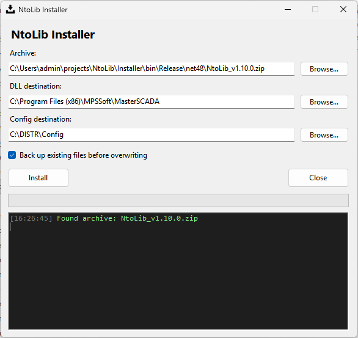

# Installer -- Установщик NtoLib

> **TL;DR:** Графический установщик, который извлекает `NtoLib.dll` и сопутствующие файлы из zip-архива, разблокирует скачанные файлы, копирует их в каталог MasterSCADA, разворачивает конфигурацию по умолчанию и выполняет COM-регистрацию через `netreg.exe`. Требует прав администратора.



## 1. Требования

- Windows с установленной MasterSCADA 3.12
- Права администратора (UAC-запрос при запуске)
- Zip-архив `NtoLib_v*.zip`, расположенный рядом с `Installer.exe`

## 2. Интерфейс

### Поля ввода

| Поле | По умолчанию | Описание |
|------|--------------|----------|
| Archive | Автоматически найденный `NtoLib_v*.zip` | Путь к zip-архиву. Если рядом с `Installer.exe` найдено несколько архивов, выбирается самый новый по дате изменения |
| DLL destination | `C:\Program Files (x86)\MPSSoft\MasterSCADA` | Каталог, куда копируются `NtoLib.dll`, `System.Resources.Extensions.dll` и `NtoLib_reg.bat`. Здесь же должен находиться `netreg.exe` |
| Config destination | `C:\DISTR\Config` | Каталог для `DefaultConfig/`. Существующее содержимое каталога **удаляется** и заменяется содержимым из архива |

Все пути можно изменить вручную или выбрать через кнопку **Browse...**.

### Опции

| Элемент | По умолчанию | Описание |
|---------|--------------|----------|
| Back up existing files before overwriting | Включён | При установке существующие файлы сохраняются в `C:\DISTR\Backup\NtoLib\<timestamp>\` перед перезаписью |

### Кнопки

| Кнопка | Действие |
|--------|----------|
| Install | Запускает установку |
| Close | Закрывает окно |

### Ссылки

В верхней части окна расположены ссылки на GitHub:

- **Latest release** -- страница последнего релиза
- **Documentation** -- корневой файл документации (`Docs/readme.md`)

## 3. Процесс установки

При нажатии **Install** выполняются следующие шаги:

### 3.1. Проверка предусловий

- Каталог DLL destination должен существовать.
- В каталоге DLL destination должен находиться `netreg.exe`.

Если какое-либо условие не выполнено, установка прерывается с сообщением об ошибке.

### 3.2. Разблокировка архива

С архива снимается метка Zone.Identifier (Mark of the Web). Это предотвращает блокировку извлечённых файлов операционной системой, если архив был загружен из интернета.

### 3.3. Резервное копирование

Если опция резервного копирования включена:

1. Создаётся каталог `C:\DISTR\Backup\NtoLib\<yyyy-MM-dd_HH-mm-ss>\`.
2. Существующие файлы (`NtoLib.dll`, `System.Resources.Extensions.dll`, `NtoLib_reg.bat`) копируются из DLL destination в каталог резервной копии.
3. Существующий каталог Config destination копируется как `DefaultConfig/` в каталог резервной копии.

Файлы, которых нет в DLL destination, пропускаются без ошибки.

### 3.4. Извлечение и копирование файлов

1. Архив извлекается во временный каталог.
2. `NtoLib.dll`, `System.Resources.Extensions.dll` и `NtoLib_reg.bat` копируются в DLL destination с перезаписью.
3. Если в архиве есть `DefaultConfig/`, существующий каталог Config destination **удаляется целиком** и заменяется содержимым из архива.
4. Временный каталог удаляется.

### 3.5. Разблокировка DLL

После копирования со всех `*.dll` в каталоге DLL destination снимается метка Zone.Identifier. Это гарантирует, что .NET загрузит библиотеки без ошибок доверия.

### 3.6. COM-регистрация

Выполняется команда:

```
netreg.exe NtoLib.dll /showerror
```

Рабочим каталогом служит DLL destination. Вывод `netreg.exe` (stdout и stderr) отображается в журнале. Если `netreg.exe` завершается с ненулевым кодом возврата, установка считается неудачной.
