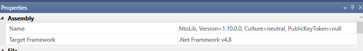

# Кэширование и сериализация компонентов в проекте MasterSCADA

## Общая проблема

MasterSCADA сохраняет (кэширует) метаданные библиотеки и сериализованное состояние функциональных блоков внутри проекта. Из-за этого обновление `NtoLib.dll` может приводить к ошибкам при открытии существующих проектов, даже если библиотека успешно зарегистрирована и новые блоки добавляются без проблем.

## 1. AssemblyName vs имя файла

MasterSCADA привязывает сохраненные в проекте элементы не к имени файла `NtoLib.dll`, а к **имени сборки (AssemblyName)** и/или полному имени типа (**AssemblyQualifiedName**).

Ситуация, когда файл называется `NtoLib.dll`, но внутри сборка имеет другое имя (например, после упаковки/слияния зависимостей), приводит к разрыву ссылок на существующие объекты библиотеки.



**Симптом:** после обновления библиотеки возникают ошибки на уже добавленных элементах (насосы, клапаны и т.п.). В некоторых случаях их удается "восстановить" через открытие/просмотр/пересохранение элементов и повторное открытие проекта, но подробно это не проверялось.

**Правило:** при сборке/упаковке строго контролировать, чтобы **AssemblyName оставался неизменным** (`NtoLib`) и не зависел от промежуточных имен (например, `*.tmp`).

## 2. Сериализация состояния FB

MasterSCADA сохраняет состояние блоков в проекте. Значения публичных параметров (properties) попадают в проект и используются при последующей загрузке.

**Правило:** для полей, не являющихся частью "контракта" блока (кэши, логгеры, буферы, сервисы, временные вычисления), использовать `[NonSerialized]` на полях. Это уменьшает объем сериализуемых данных и снижает вероятность проблем при обновлениях.

## 3. Обратная совместимость публичных параметров

Публичные значимые свойства (параметры блока) фактически становятся частью постоянного контракта с проектами. Изменение:

- имени свойства
- типа свойства
- формата значения

может привести к ошибкам десериализации и невозможности открыть/загрузить старые проекты.

**Пример:** в свойстве ниже нельзя заменить тип на `int` без риска несовместимости со старыми проектами:

```csharp
[DisplayName("01. IP адрес контроллера байт 1")]
public uint UControllerIp1
{
    get => _controllerIp1;
    set => _controllerIp1 = value;
}
```

При необходимости изменения следует вводить новый параметр с новым именем и обеспечивать миграцию/обратную совместимость.

## 4. COM/типовая идентичность

Если элементы библиотеки используются как COM-visible типы, то кроме AssemblyName важны также **GUID** и **ProgId**. Изменение GUID класса или CLSID приведет к тому, что существующие проекты не смогут создать ранее сохраненные экземпляры.

## Сводка правил

| Что | Правило |
|-----|---------|
| AssemblyName | Должен оставаться `NtoLib` при любой сборке/упаковке |
| `[NonSerialized]` | Обязательно для полей, не входящих в контракт блока |
| Публичные свойства FB | Не менять имя/тип без миграции; вводить новые параметры |
| COM GUID/CLSID | Не менять после первого релиза класса |
