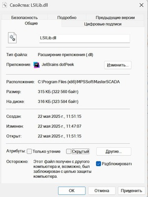
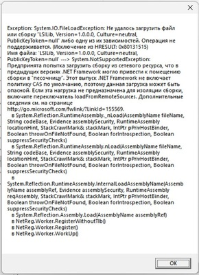
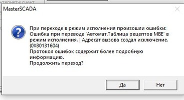

# Ошибки при развёртывании и регистрации NtoLib

## Описание проблемы

После распаковки релизного архива и регистрации `NtoLib.dll` через `netreg.exe` могут возникать ошибки различного характера. Большинство из них связаны с тем, что Windows блокирует файлы, загруженные из сети (скачанные архивы, вложения из писем).

---

## 1. Ошибка GUID при запуске проекта / блок не отображается

### Симптомы

При запуске проекта MasterSCADA возникает неизвестная ошибка с указанием GUID блока, либо блок отсутствует в палитре.

### Причина

Windows пометил файлы из распакованного архива как заблокированные (Zone.Identifier). MasterSCADA не может загрузить заблокированную DLL.

### Решение

Открыть свойства файла `NtoLib.dll` (и других файлов из архива) и снять блокировку:



Альтернативно, можно разблокировать файл через PowerShell:

```powershell
Unblock-File -Path "C:\path\to\NtoLib.dll"
```

---

## 2. Ошибка регистрации COM-объекта через NetReg

### Симптомы

При запуске `NtoLib_reg.bat` (вызов `netreg.exe`) возникает ошибка регистрации:



### Причина

Та же -- Windows заблокировал DLL после распаковки из архива.

### Решение

Разблокировать `NtoLib.dll` перед регистрацией (см. раздел 1).

---

## 3. Ошибка перехода на экран с блоком / ошибка при старте проекта

### Симптомы

При переходе на экран с блоком или при старте проекта возникает ошибка с кодом, не относящимся к SCADA:



### Причина

Возможны два варианта:

1. **Заблокированная DLL** -- см. раздел 1.
2. **Ошибка сборки** -- не все зависимые DLL были упакованы в `NtoLib.dll` при ILRepack. Если в сообщении указан код ошибки -- это исключение .NET, по которому можно найти информацию.

### Решение

1. Убедиться, что `NtoLib.dll` разблокирована.
2. Если разблокировка не помогла -- проверить, что используется корректная сборка из официального релиза. При самостоятельной сборке убедиться, что скрипт `Build/Package.ps1` завершился без ошибок.

---

## 4. Блок не появляется / визуальный контрол молча не добавляется (нет ошибки, нет логов)

### Симптомы

Новый (или переименованный) FB либо его визуальный контрол не добавляется при
drag-and-drop на схему. Исключение не выбрасывается, окно ошибки не появляется, в Debug и в
лог-папке пусто.

### Причина

COM-инстанс контрола создаётся через `CoCreateInstance` по CLSID. Если CLSID не
зарегистрирован, активация молча проваливается **до** запуска управляемого кода -- поэтому
нет ни .NET-исключения, ни логов (логирование стартует только в `ToRuntime`).

Два типичных источника незарегистрированного CLSID:

1. **`netreg` запущен без прав администратора.** `netreg.exe` при старте пишет файл
   `netreg.log` в свою папку (внутри `Program Files`) и без elevation падает с
   `UnauthorizedAccessException`, **ничего не зарегистрировав** -- часто без видимой ошибки.
   Запись ключей COM в `HKLM\SOFTWARE\WOW6432Node\Classes\CLSID` также требует elevation.
2. **`Build/Deploy.ps1` только копирует DLL и не вызывает `netreg`.** Новые типы остаются
   незарегистрированными до отдельного запуска регистрации.

Кроме того: переименование namespace/типа (полного имени класса) или новый `[Guid]` делают
старую запись CLSID устаревшей -- она указывает на тип, которого больше нет в сборке.

### Решение

1. Развернуть DLL (`Build/Deploy.ps1`).
2. Зарегистрировать из **командной строки, запущенной от имени администратора**, в папке
   установки MasterSCADA:
   ```
   netreg.exe NtoLib.dll /showerror      (или NtoLib_reg.bat -> "Запуск от имени администратора")
   ```
3. **Перезапустить MasterSCADA** -- метаданные библиотеки кэшируются, новые/обновлённые типы
   подхватываются только после перезапуска.

### Проверка

```
reg query "HKLM\SOFTWARE\WOW6432Node\Classes\CLSID\{<guid-типа>}\InprocServer32"
```
Значение `Class` должно совпадать с полным именем типа из текущей сборки. Отсутствие раздела
= тип не зарегистрирован.

Повторная регистрация нужна при добавлении нового типа, смене `[Guid]` или переименовании
namespace/класса; обычные правки уже зарегистрированного типа её не требуют.
