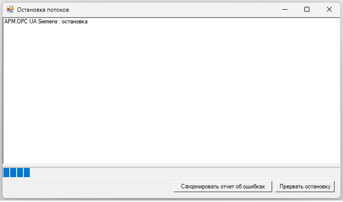

# LinkSwitcher — Перелинковка связей между структурно идентичными объектами

 Переключатель связей - функциональный блок для автоматической перелинковки всех внешних связей между парами структурно идентичных объектов в дереве проекта MasterSCADA.

---

## 1. Назначение

В проектах MasterSCADA используется оборудование с идентичной структурой (например, `Termodat` / `Termodat2`). При необходимости подменить один прибор другим требуется перенести все связи с одного объекта на другой. Ручная перелинковка десятков каналов с десятками пинов в каждом -- трудоёмкая и ошибкоопасная операция.

LinkSwitcher автоматизирует этот процесс:

- находит все пары объектов по паттерну `<Name>` / `<Name>2` среди прямых потомков контейнера (1 уровень вложенности);
- проверяет структурную идентичность каждой пары (при несовпадении -- предупреждение, перелинковка всё равно выполняется);
- операция ставится в очередь в Runtime и выполняется при переходе в Design mode.
- переносит все внешние связи (обычные и с обратной связью) с одного объекта пары на другой;

---

## 2. Интерфейс

### Входы (Pin)

| ID | Имя | Тип | Описание |
|----|-----|-----|----------|
| 1 | Execute | Логический | Фронт `false -> true` запускает операцию (сканирование, постановка в очередь) |
| 2 | Reverse | Логический | `false` (по умолчанию) -- прямое направление (`<Name>` -> `<Name>2`), `true` -- обратное (`<Name>2` -> `<Name>`) |
| 3 | Cancel | Логический | Фронт `false -> true` отменяет ожидающую операцию (пока не перешли в Design mode) |

### Выходы (Pout)

| ID | Имя | Тип | Описание |
|----|-----|-----|----------|
| 101 | IsPending | Логический | `true` если задача в очереди, ожидает перехода в Design mode |

### Параметры (окно настроек)

| Свойство | Тип | По умолчанию | Описание |
|----------|-----|--------------|----------|
| Путь для поиска пар объектов | string | `Система.АРМ.OPC UA Siemens.ServerInterfaces.MBE` | Путь к контейнеру в дереве проекта, в котором ищутся пары `<Name>` / `<Name>2` |

---

## 3. Структура данных в дереве

### 3.1. Контейнер и пары объектов

На вход подаётся путь `SearchPath` (через окно настроек) -- контейнер, в котором ФБ ищет пары.

Пары определяются среди **прямых потомков** контейнера по паттерну имени:

```text
SearchPath/
├── Termodat          <-- <Name>
├── Termodat2         <-- <Name>2   -> пара найдена
├── Vacuummeter       <-- <Name>
├── Vacuummeter2      <-- <Name>2   -> пара найдена
├── Recipe            <-- нет Recipe2 -> игнорируется
└── ...
```

Объекты, для которых пара не найдена, игнорируются без ошибки.

### 3.2. Внутренняя структура объектов пары

Объекты в паре **проверяются** на структурную идентичность: одинаковые дочерние элементы на всех уровнях вложенности. Если структура не совпадает -- в лог-файл записывается предупреждение с перечислением различий, но операция перелинковки **продолжается**.

```text
Termodat/                    Termodat2/
├── CH1                      ├── CH1
│   ├── StatusWord           │   ├── StatusWord
│   ├── ControlWord          │   ├── ControlWord
│   ├── Kp                   │   ├── Kp
│   ├── Ki                   │   ├── Ki
│   ├── MaxPower             │   ├── MaxPower
│   ├── TemperatureSP        │   ├── TemperatureSP
│   ├── ActualTemperature    │   ├── ActualTemperature
│   ├── ActualPower          │   ├── ActualPower
│   ├── Kd                   │   ├── Kd
│   ├── RampSpeed            │   ├── RampSpeed
│   └── ActualTempSP         │   └── ActualTempSP
├── CH2                      ├── CH2
│   └── ...                  │   └── ...
└── CH16                     └── CH16
    └── ...                      └── ...
```

---

## 4. Перелинковка

### 4.1. Что такое перелинковка

Перелинковка -- это перенос внешних связей с пинов объекта-источника на соответствующие пины объекта-приёмника. Связь **удаляется** из источника и **создаётся** в приёмнике.

```text
До перелинковки (прямое направление, Termodat -> Termodat2):

  OPC_Server.Tag1 ──связь──> Termodat.CH1.StatusWord
  Termodat.CH1.ActualTemperature ──связь──> HMI.Display1

После перелинковки:

  OPC_Server.Tag1 ──связь──> Termodat2.CH1.StatusWord
  Termodat2.CH1.ActualTemperature ──связь──> HMI.Display1
```

### 4.2. Сопоставление пинов

Пины сопоставляются по относительному пути внутри объекта:

```text
Источник: SearchPath.Termodat.CH1.StatusWord
Приёмник: SearchPath.Termodat2.CH1.StatusWord
                                ^^^^^^^^^^^
Относительный путь: CH1.StatusWord (совпадает по имени)
```

### 4.3. Типы связей

Переносятся **все** типы связей:
- обычные связи (входящие и исходящие);
- связи с обратной связью (feedback).

### 4.4. Направление переключения

Управляется входным пином `Reverse`:
- `Reverse = false` (по умолчанию, прямое): связи переносятся с `<Name>` на `<Name>2`;
- `Reverse = true` (обратное): связи переносятся с `<Name>2` на `<Name>`.

Направление единое для всех пар, найденных за один вызов.

### 4.5. Отсутствие связей

Если у объекта-источника нет внешних связей для переноса -- ничего не делаем, ошибки нет.

---

## 5. Режимы работы: Runtime / Design

MasterSCADA запрещает модификацию связей в Runtime. Поэтому:

1. В **Runtime** при фронте `Execute` ФБ выполняет сканирование дерева, проверку структуры, формирование плана операций и ставит задачу в очередь.
2. При переходе в **Design mode** может открыться модальное окно **"Остановка потоков"**. Поэтому ФБ запускает таймер (`System.Windows.Forms.Timer`, интервал 200 мс), который периодически проверяет закрылось ли окно и произошел ли переход в режим редактирования.



3. Как только `InRuntime` становится `false` (после `RTManager.Done()`), таймер выполняет план перелинковки и самоуничтожается.
4. Если `InRuntime` не перешёл в `false` за 20 секунд (100 попыток x 200 мс), исполнение прерывается с ошибкой в лог-файле.
5. Результат отложенного исполнения записывается в лог-файл на диске (см. раздел 7).

> **Внимание:** После постановки задачи в очередь не изменяйте дерево объектов, рекомендуется сразу перейти в режим редактирования.

> **Внимание:** После остановки Runtime не изменяйте дерево проекта вручную в течение ~20 секунд. Таймер отложенного исполнения работает в фоне на STA-потоке, и ручные модификации дерева могут конфликтовать с автоматической перелинковкой.

> **Внимание:** В интерфейсе MasterSCADA нет визуальной индикации хода или завершения отложенного исполнения. Чтобы убедиться, что операция завершена, отслеживайте лог-файл (`C:\DISTR\Logs\link-switcher.log`). Ищите строку `"Result: N/N OK"` или сообщения об ошибках.

---

## 6. Логика работы

### 6.1. Сканирование и проверка (Runtime, по фронту Execute)

1. Проверить, что `SearchPath` не пуст и объект по указанному пути существует.
2. Найти все пары `<Name>` / `<Name>2` среди прямых потомков контейнера.
3. Для каждой найденной пары:
   - проверить структурную идентичность (одинаковые дочерние элементы на всех уровнях);
   - если есть структурные различия -- записать предупреждение в лог, но продолжить обработку пары;
   - собрать список всех внешних связей (обычных и с обратной связью) на пинах объекта-источника;
   - если сбор связей для конкретной пары завершился ошибкой -- записать ошибку в лог и перейти к следующей паре.
4. Если суммарно по всем парам не найдено ни одной связи для переноса -- операция завершается с ошибкой.
5. Если пар не найдено -- операция завершается с ошибкой.

### 6.2. Формирование плана и постановка в очередь (Runtime)

Если найдены связи для переноса:

1. Сформировать план операций: для каждой связи -- откуда отсоединить, куда присоединить, сгруппировано по парам.
2. Записать план в лог-файл (сводка по парам с указанием количества связей и структурных предупреждений).
3. Задача поставлена в очередь.
4. `IsPending = true`.
5. Ожидание перехода в Design mode.

### 6.3. Исполнение (Design mode, отложенное через таймер)

При переходе в Design mode:

1. ФБ проверяет наличие ожидающей задачи.
2. Запускается `System.Windows.Forms.Timer` (интервал 200 мс, до 100 попыток = 20 секунд).
3. Каждый тик таймера проверяет `IProjectHlp.InRuntime`:
   - если `true` — уменьшает счётчик попыток и ожидает следующего тика;
   - если `false` — останавливает таймер и выполняет план.
4. Если все 100 попыток исчерпаны, а `InRuntime` всё ещё `true`, исполнение прерывается с ошибкой в лог-файле.
5. Исполнение группируется по парам. Для каждой пары:
   - в лог записывается заголовок пары;
   - для каждой операции из плана:
     - выполняется отсоединение связи от пина источника;
     - выполняется присоединение связи к пину приёмника;
     - результат записывается в лог-файл (с относительными путями пинов от корня пары).
6. Если операция для конкретного пина завершилась ошибкой:
   - ошибка фиксируется в лог-файле;
   - исполнение **продолжается** для остальных пинов.
7. Итоговый результат (количество успешных и ошибочных операций) записывается в лог-файл.

> **Примечание:** Результат отложенного исполнения не отражается на выходных пинах. MasterSCADA заменяет экземпляр ФБ между циклами Runtime, поэтому буферизация результатов в полях ФБ невозможна. Лог-файл является единственным источником информации о результате исполнения.

### 6.4. Отмена операции (Runtime, по фронту Cancel)

По фронту `Cancel`:

1. Если `IsPending = true` -- задача удаляется из очереди.
2. `IsPending = false`.
3. Факт отмены записывается в лог-файл.

---

## 7. Логирование

Все события (сканирование, проверка структуры, план, исполнение, ошибки) записываются в файл на диске:

- **Путь по умолчанию:** `C:\DISTR\Logs\link-switcher.log`
- **Ротация:** по размеру файла (5 МБ), без ротации по дате
- **Количество файлов:** до 5 (старые удаляются)

### 7.1. Формат лога

Лог группируется по парам. Полный путь к контейнеру указывается один раз в заголовке сканирования. Далее для каждой пары выводится заголовок с именами объектов, результат проверки структуры, и список связей.

Каждая строка связи содержит:
- **Тип связи** -- `[direct]` для обычных связей, `[feedback]` для обратной связи (IConnect)
- **Пин источника** (откуда связь отсоединяется) -- относительный путь от контейнера
- `->` -- стрелка перенаправления
- **Пин приёмника** (куда связь присоединяется) -- относительный путь от контейнера
- `:` -- разделитель
- **Внешний пин** -- полный путь (за пределами контейнера, поэтому не сокращается)

Колонка `[тип] источник -> приёмник` выравнивается пробелами в пределах каждой пары для читаемости.

При исполнении аналогично: заголовок пары, затем результат каждой операции в том же формате с префиксом `[OK]` или `[ERR]`.

### 7.2. Срок жизни лог-файлов

Лог-файлы **не удаляются автоматически** — они ротируются только при достижении лимита 5 МБ. При ротации старый файл получает суффикс: `link-switcher_001.log`, `link-switcher_002.log` и т.д. (до 5 файлов). Максимальный суммарный объём на диске: ~25 МБ.

Лог-файлы сохраняются между перезапусками MasterSCADA. Для очистки логов удалите файлы вручную из `C:\DISTR\Logs\`.

---

## 8. Обработка ошибок

### 8.1. Ошибки сканирования (прерывают всю операцию)

| Ситуация | Поведение |
|----------|-----------|
| `SearchPath` пуст или объект не найден | Ошибка в лог-файле, операция отменена |
| Пары `<Name>` / `<Name>2` не найдены | Ошибка в лог-файле, операция отменена |
| Ни одной связи для переноса ни у одной пары | Предупреждение в лог-файле, операция отменена |

### 8.2. Предупреждения (не прерывают операцию)

| Ситуация | Поведение |
|----------|-----------|
| Структурное несоответствие в паре | Предупреждение в лог-файле, перелинковка пары продолжается |
| Сбор связей для конкретной пары завершился ошибкой | Ошибка в лог-файле, остальные пары обрабатываются |

### 8.3. Ошибки исполнения (не прерывают операцию)

| Ситуация | Поведение |
|----------|-----------|
| Не удалось найти пин по пути | Ошибка в лог-файле, переход к следующей операции |
| Не удалось отсоединить/присоединить конкретную связь | Ошибка в лог-файле, переход к следующей связи |
| Часть связей не перенесена | Сводка ошибок в лог-файле |
| Все связи перенесены | Сводка успеха в лог-файле |

### 8.4. Ошибки инициализации

| Ситуация | Поведение |
|----------|-----------|
| `TreeItemHlp.Project` недоступен | Ошибка в лог-файле, блок не обрабатывает команды |

---

## 9. Особенности поведения

- **Best-effort перелинковка:**
  Структурные различия в парах не прерывают операцию. Различия логируются как предупреждения. Ошибки сбора связей для конкретной пары также не прерывают обработку остальных пар. Операция прерывается только если суммарно не найдено ни одной связи для переноса.

- **Отложенное исполнение:**
  Перелинковка выполняется не в момент команды, а при переходе из Runtime в Design mode. Таймер ожидает до 20 секунд, пока `InRuntime` не станет `false`. Результат записывается в лог-файл.

- **Не модифицируйте дерево вручную после остановки Runtime:**
  В течение ~20 секунд после остановки Runtime таймер отложенного исполнения может ещё работать. Ручные изменения связей в этот период могут конфликтовать с автоматической перелинковкой.

- **Нет визуальной индикации:**
  В интерфейсе MasterSCADA нет индикатора хода или завершения отложенного исполнения. Для контроля результата используйте лог-файл `C:\DISTR\Logs\link-switcher.log`.

- **Замена экземпляра ФБ:**
  MasterSCADA заменяет экземпляр ФБ между циклами Runtime (десериализация из снимка, сделанного до исполнения). Поэтому буферизация результатов в полях ФБ невозможна. Результат отложенного исполнения доступен только в лог-файле.

- **Неатомарность на уровне связей:**
  При исполнении ошибка отдельной связи не прерывает перенос остальных. Частично перенесённые связи остаются в новом состоянии -- механизма отката нет.

- **Повторный запуск:**
  Каждый фронт `Execute` полностью перестраивает план на основании текущего состояния дерева. Предыдущий план (если не был исполнен) заменяется новым.
