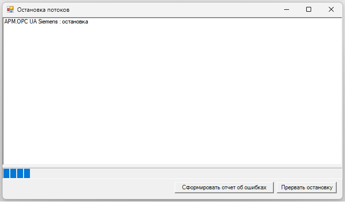

# LinkSwitcher -- Переключатель связей

> **Кратко:** Автоматически переносит все внешние связи между парами структурно идентичных объектов (`Name` / `Name2`) в дереве проекта. Сканирование и планирование выполняются в режиме исполнения, а само переключение связей -- отложенно, после перехода в режим разработки. Результат записывается в лог-файл.



## 1. Интерфейс

### Входы

| ID | Имя | Тип | Описание |
|----|-----|-----|----------|
| 1 | Execute | bool | Фронт `0 -> 1` запускает сканирование и постановку в очередь |
| 2 | Reverse | bool | `false` -- прямое (`Name -> Name2`), `true` -- обратное (`Name2 -> Name`) |
| 3 | Cancel | bool | Фронт `0 -> 1` отменяет ожидающую операцию |

### Выходы

| ID | Имя | Тип | Описание |
|----|-----|-----|----------|
| 101 | IsPending | bool | `true` если задача в очереди, ожидает перехода в режим разработки |

### Параметры (окно настроек)

| Свойство | По умолчанию | Описание |
|----------|--------------|----------|
| Путь для поиска пар объектов | `Система.АРМ.OPC UA Siemens.ServerInterfaces.MBE` | Контейнер в дереве проекта, в котором ищутся пары |
| Путь для записи лога | `C:\DISTR\Logs\link-switcher.log` | Полный путь к файлу лога |

## 2. Обнаружение пар

Пары определяются среди **прямых потомков** контейнера по шаблону имени:

```text
SearchPath/
├── Termodat          <-- Name
├── Termodat2         <-- Name2   -> пара найдена
├── Vacuummeter       <-- Name
├── Vacuummeter2      <-- Name2   -> пара найдена
├── Recipe            <-- нет Recipe2 -> игнорируется
```

Объекты без пары игнорируются без ошибки.

Объекты в паре проверяются на структурную идентичность (одинаковые дочерние элементы на всех уровнях). Различия записываются как предупреждения в лог, но переключение связей продолжается.

## 3. Переключение связей

### Что переносится

Все внешние связи с входов и выходов объекта-источника на соответствующие входы и выходы объекта-приёмника:
- обычные связи (входящие и исходящие);
- связи с обратной связью (feedback / IConnect).

Сигналы сопоставляются по относительному пути внутри объекта:
`SearchPath.Termodat.CH1.StatusWord` -> `SearchPath.Termodat2.CH1.StatusWord`.

### Направление

Управляется входом `Reverse`:
- `false` (по умолчанию): связи переносятся с `Name` на `Name2`;
- `true`: связи переносятся с `Name2` на `Name`.

Направление единое для всех пар за один вызов.

## 4. Режим исполнения

MasterSCADA запрещает изменение связей в режиме исполнения. Поэтому:

1. **Режим исполнения** (фронт Execute): сканирование дерева, проверка структуры, формирование плана, `IsPending = true`.
2. **Переход в режим разработки**: ФБ ожидает завершения перехода (до 20 секунд).
3. Как только переход завершён, выполняется план переключения связей.
4. Если за 20 секунд переход не завершился -- ошибка в лог-файле.


> **Важно:** После остановки режима исполнения не изменяйте дерево проекта вручную в течение ~20 секунд -- отложенная операция ещё может выполняться.

> **Важно:** Результат отложенного исполнения доступен только в лог-файле. Выходы не обновляются после исполнения (экземпляр ФБ заменяется между циклами режима исполнения).

## 5. Обработка ошибок

### Ошибки сканирования (прерывают операцию)

| Ситуация | Поведение |
|----------|-----------|
| Путь поиска пуст или объект не найден | Ошибка в лог, операция отменена |
| Пары не найдены | Ошибка в лог, операция отменена |
| Ни одной связи для переноса | Ошибка в лог, операция отменена |

### Предупреждения (не прерывают операцию)

| Ситуация | Поведение |
|----------|-----------|
| Структурное несоответствие в паре | Предупреждение в лог, переключение связей продолжается |
| Сбор связей для конкретной пары не удался | Ошибка в лог, остальные пары обрабатываются |

### Ошибки исполнения (не прерывают операцию)

| Ситуация | Поведение |
|----------|-----------|
| Сигнал не найден по пути | Ошибка в лог, переход к следующей операции |
| Не удалось отсоединить/присоединить связь | Ошибка в лог, переход к следующей связи |

Механизма отката нет -- частично перенесённые связи остаются в новом состоянии.

## 6. Логирование

- **Путь:** настраивается через свойство (по умолчанию `C:\DISTR\Logs\link-switcher.log`)
- **Ротация:** по размеру 5 МБ, до 5 файлов (суммарно ~25 МБ)
- **Содержимое:** сканирование, структурные предупреждения, план операций, результат исполнения

Для каждой связи в логе указывается тип (`[direct]` / `[feedback]`), вход/выход источника, вход/выход приёмника и внешний вход/выход. При исполнении -- `[OK]` или `[ERR]` для каждой операции и итоговая сводка.

Каждый фронт Execute полностью перестраивает план. Предыдущий неисполненный план заменяется новым.
