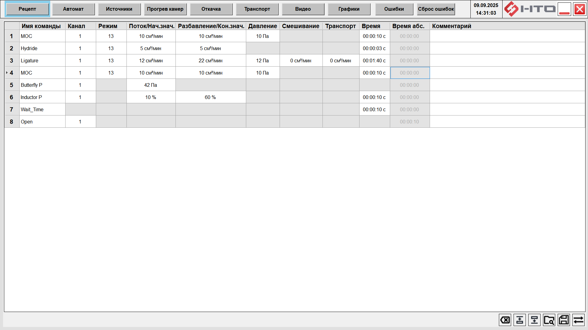
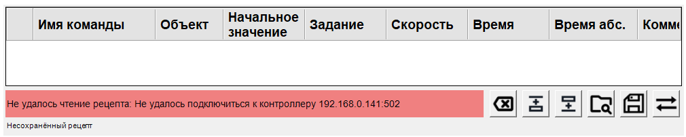
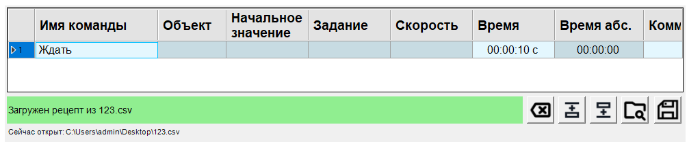

# MbeTable — Таблица рецептов MBE

Функциональный блок **MasterSCADA 3.12** для создания, редактирования, исполнения и
передачи в ПЛК технологических рецептов установок MBE/MOCVD.



---

## Содержание

**Часть I. Руководство пользователя**

- [1. Общие сведения](#1-общие-сведения)
    - [1.1. Назначение](#11-назначение)
    - [1.2. Ключевые возможности](#12-ключевые-возможности)
    - [1.3. Платформа и требования](#13-платформа-и-требования)
    - [1.4. Установка и регистрация](#14-установка-и-регистрация)
    - [1.5. Поведение при загрузке](#15-поведение-при-загрузке)
- [2. Пользовательский интерфейс](#2-пользовательский-интерфейс)
    - [2.1. Табличное представление](#21-табличное-представление)
    - [2.2. Режимы выбора: строка и ячейка](#22-режимы-выбора-строка-и-ячейка)
    - [2.3. Навигация и горячие клавиши](#23-навигация-и-горячие-клавиши)
    - [2.4. Операции со строками](#24-операции-со-строками)
    - [2.5. Контекстное меню](#25-контекстное-меню)
    - [2.6. Блокировка редактирования](#26-блокировка-редактирования)
    - [2.7. Отображение исполнения](#27-отображение-исполнения)
    - [2.8. Подсветка ячеек по умолчанию](#28-подсветка-ячеек-по-умолчанию)
- [3. Модель данных рецепта](#3-модель-данных-рецепта)
    - [3.1. Структура рецепта](#31-структура-рецепта)
    - [3.2. Служебные действия](#32-служебные-действия)
    - [3.3. Циклы (For)](#33-циклы-for)
    - [3.4. Связанные параметры (формулы)](#34-связанные-параметры-формулы)
    - [3.5. Валидация данных](#35-валидация-данных)
- [4. Контракт входов и выходов](#4-контракт-входов-и-выходов)
    - [4.1. Входы](#41-входы)
    - [4.2. Выходы](#42-выходы)
    - [4.3. Динамические входы оборудования](#43-динамические-входы-оборудования)
    - [4.4. Расчёт оставшегося времени](#44-расчёт-оставшегося-времени)
- [5. Импорт и экспорт CSV](#5-импорт-и-экспорт-csv)
- [6. Логирование](#6-логирование)

**Часть II. Настройка и техническая спецификация**

- [7. Конфигурация (YAML)](#7-конфигурация-yaml)
    - [7.1. Состав и порядок загрузки](#71-состав-и-порядок-загрузки)
    - [7.2. PropertyDefs.yaml](#72-propertydefsyaml)
    - [7.3. ColumnDefs.yaml](#73-columndefsyaml)
    - [7.4. PinGroupDefs.yaml](#74-pingroupdefsyaml)
    - [7.5. ActionsDefs.yaml](#75-actionsdefsyaml)
    - [7.6. Ошибки конфигурации](#76-ошибки-конфигурации)
- [8. Обмен с ПЛК по Modbus TCP](#8-обмен-с-плк-по-modbus-tcp)
    - [8.1. Визуальные свойства блока](#81-визуальные-свойства-блока)
    - [8.2. Карта памяти ПЛК](#82-карта-памяти-плк)
    - [8.3. Формат данных INT/FLOAT](#83-формат-данных-intfloat)
    - [8.4. Отправка рецепта](#84-отправка-рецепта)
    - [8.5. Чтение рецепта](#85-чтение-рецепта)
    - [8.6. Повторы, таймауты, разрывы соединения](#86-повторы-таймауты-разрывы-соединения)
- [9. Особенности вендоров ПЛК](#9-особенности-вендоров-плк)

---

**Часть I. Руководство пользователя**

---

## 1. Общие сведения

### 1.1. Назначение

MbeTable предназначен для:

- создания, редактирования и проверки технологических рецептов (последовательностей шагов);
- передачи рецептов в ПЛК по Modbus TCP и обратного чтения;
- контроля состояния исполнения рецепта в режиме реального времени;
- сохранения рецепта в файл CSV и загрузки из файла.

Вся бизнес-логика, структура таблицы и набор команд задаются текстовыми YAML-файлами, поэтому
один и тот же блок применяется к разным установкам (MBE, MOCVD и др.) без перекомпиляции.

> Существует вариант блока без обмена с ПЛК — **«Редактор рецептов MBE»** (`MbeTableEditorFB`),
> предназначенный только для подготовки рецептов (редактирование, CSV, буфер обмена, статический
> расчёт времени). Подробнее — [Редактор рецептов MBE](mbe-table-editor.md).

---

### 1.2. Ключевые возможности

- **Гибкая настройка.** Структура таблицы, типы данных, набор действий и связи параметров
  определяются в YAML-файлах (раздел 7).
- **Динамический интерфейс.** Столбцы, редакторы ячеек и выпадающие списки генерируются
  автоматически по конфигурации.
- **Мониторинг исполнения.** Подсветка текущего шага, тонировка циклов и расчёт оставшегося
  времени по данным от ПЛК.
- **Интеграция с ПЛК.** Передача и чтение рецепта по Modbus TCP с обратной сверкой данных.
- **Динамические входы оборудования.** Входы объектов (заслонки, нагреватели и т.п.)
  создаются автоматически по `PinGroupDefs.yaml`.

---

### 1.3. Платформа и требования

| Компонент    | Значение                          |
| ------------ | --------------------------------- |
| Среда        | MasterSCADA 3.12                  |
| Платформа    | .NET Framework 4.8                |
| Протокол ПЛК | Modbus TCP                        |
| Конфигурация | YAML-файлы в каталоге конфигурации |

---

### 1.4. Установка и регистрация

1. Скопируйте `NtoLib.dll` и `System.Resources.Extensions.dll` в корневую папку установки
   MasterSCADA.
2. Зарегистрируйте библиотеку **от имени администратора** — запустите `NtoLib_reg.bat` («Запуск
   от имени администратора») либо в командной строке администратора выполните
   `netreg.exe NtoLib.dll /showerror`. Без прав администратора регистрация не выполняется, и блок
   не появится / не будет добавляться на схему без сообщения об ошибке.
3. Перезапустите MasterSCADA, чтобы библиотека перечиталась.
4. Поместите в каталог конфигурации четыре YAML-файла (раздел 7). Готовые шаблоны для проектов —
   в [`DefaultConfig/MBE`](../DefaultConfig/MBE).
5. Добавьте на схему элемент «Таблица рецептов MBE».

Каталог конфигурации задаётся свойством блока «Путь к конфигурационному каталогу» (раздел 7.1).

---

### 1.5. Поведение при загрузке

- Загрузка конфигурации стартует либо по клику на объекте в дереве (требуется для отображения
  входов и выходов), либо при переходе на экран с объектом — смотря что произойдёт раньше.
- Для повторной загрузки конфигурации нужно перезапустить MasterSCADA, чтобы объект
  инициализировался заново.

[↑ К содержанию](#содержание)

---

## 2. Пользовательский интерфейс

### 2.1. Табличное представление

Рецепт отображается интерактивной таблицей:

- строки соответствуют шагам рецепта (1..N);
- столбцы соответствуют параметрам и служебным полям шага;
- заголовок столбцов отображает названия параметров.

Взаимодействие построено на привычных по табличным редакторам практиках работы мышью и
клавиатурой.

---

### 2.2. Режимы выбора: строка и ячейка

Поведение операций (в частности, вставки `Ctrl+V`) зависит от взаимоисключающего режима выбора.

| Режим            | Активация                                                            | Цель операций                  |
| ---------------- | ------------------------------------------------------------------- | ------------------------------ |
| **Выбор строки** | Клик по заголовку строки (область с номером) или `Shift`+стрелки    | Вся строка / группа строк      |
| **Выбор ячейки** | Клик по редактируемой ячейке внутри строки                          | Содержимое конкретной ячейки   |

Визуальная индикация:

- **Выделенная строка** подсвечивается отчётливым цветом — операции применяются к ней целиком.
- **Активная ячейка** обводится рамкой фокуса — система готова к вводу данных.
- **Исполняемая строка** (`ActualLineNumber`) подсвечивается отдельным цветом для отслеживания
  прогресса исполнения.

---

### 2.3. Навигация и горячие клавиши

| Комбинация                     | Действие                                                   |
| ------------------------------ | --------------------------------------------------------- |
| `Ctrl+C`                       | Копировать строки                                         |
| `Ctrl+X`                       | Вырезать строки                                           |
| `Ctrl+V`                       | Вставить строки (режим строки) / текст (режим ячейки)     |
| `Ctrl+N`                       | Создать новую строку                                      |
| `Del`                          | Удалить строки                                            |
| `Ctrl+A`                       | Выделить все строки                                       |
| `Ctrl`+клик по заголовку строки | Несмежное выделение (добавить/убрать строку)             |
| `Shift`+клик / `Shift`+стрелки | Выделить диапазон строк                                   |

---

### 2.4. Операции со строками

Все операции, изменяющие рецепт, доступны только при `RecipeActive = false`. Любая успешная
изменяющая операция переводит выход `IsRecipeConsistent` в `false`.

| Операция            | Клавиша  | Поведение                                                                                 |
| ------------------- | -------- | ---------------------------------------------------------------------------------------- |
| Копировать строки   | `Ctrl+C` | Данные выделенных строк помещаются в буфер в формате TSV (значения, разделённые табуляцией); копируются только колонки с `save_to_csv: true`. Доступно всегда |
| Вырезать строки     | `Ctrl+X` | Строки копируются в буфер и удаляются из таблицы                                          |
| Вставить строки     | `Ctrl+V` | Строки из буфера вставляются после выделенной (или в конец, если выделения нет). Перед вставкой выполняется полная доменная валидация, как при импорте CSV; при ошибке операция отменяется с уведомлением |
| Удалить строки      | `Del`    | Выделенные строки удаляются                                                               |
| Создать новую строку | `Ctrl+N` | Новая строка добавляется после выделенной (или в конец). Содержит действие и параметры по умолчанию из `ActionsDefs.yaml` |

---

### 2.5. Контекстное меню

Вызывается правым кликом по заголовку строки и содержит пункты всех операций со строками
(`Копировать`, `Вырезать`, `Вставить`, `Удалить`, `Создать новую`). Меню динамическое:

- `Вырезать`, `Копировать`, `Удалить` активны только при наличии выделенных строк;
- `Вставить` активен, если буфер содержит совместимые данные;
- все изменяющие пункты неактивны при `RecipeActive = true`.

---

### 2.6. Блокировка редактирования

При `RecipeActive = true` таблица переходит в режим исполнения: редактирование и все изменяющие
структуру или данные операции (`Cut`, `Paste`, `Del`, `New`) блокируются, чтобы исключить
неконсистентность исполняемого рецепта.

---

### 2.7. Отображение исполнения

При получении данных от ПЛК блок отражает прогресс исполнения:

- **Исполняемая строка** (`ActualLineNumber`, нумерация с 0) подсвечивается; пройденные строки
  тонируются согласно цветовой схеме.
- **Тонировка циклов.** Строки внутри вложенных блоков `For` получают дополнительную фоновую
  подсветку (фиолетовые оттенки): чем глубже уровень вложенности, тем заметнее цвет.
- **Совмещение состояний.** Если строка одновременно в цикле и исполняется, цвет цикла и
  подсветка исполнения накладываются: текущий шаг подсвечивается ярче, уже пройденные — более
  приглушённо, сохраняя оттенок цикла.
- **Цвет пройденной ячейки по умолчанию** — `Transparent`; в этом случае дополнительная окраска
  не накладывается.
- **Оставшееся время** шага (`LineTimeLeft`) и рецепта (`TotalTimeLeft`) выводится на
  соответствующих выходах (раздел 4.4).

**Имя текущего рецепта.** В самом низу блока расположена тонкая строка с именем открытого
рецепта. Пока рецепт не загружен, в ней выводится «Несохранённый рецепт». После загрузки
рецепта из файла или его сохранения строка показывает «Сейчас открыт: <полный путь к файлу>».
Длинный путь усекается, полный путь виден при наведении указателя.
Чтение рецепта из ПЛК файлом не считается — после него строка возвращается к «Несохранённый
рецепт». Имя файла хранится только в текущем сеансе работы: после перезапуска MasterSCADA или
пересоздания блока строка снова показывает «Несохранённый рецепт».

Строка без загруженного файла (фон строки прозрачный, сливается с фоном блока):



Строка с загруженным файлом:



---

### 2.8. Подсветка ячеек по умолчанию

При смене действия в строке (изменение значения в колонке «Действие») блок полностью
перестраивает строку под новый тип действия и заполняет её параметры значениями по умолчанию из
`ActionsDefs.yaml`. Чтобы оператор не пропустил это автоматическое изменение, все затронутые
ячейки строки подсвечиваются **оранжевым фоном**.

Что именно подсвечивается:

- подсвечиваются только редактируемые ячейки строки, применимые к новому действию;
- колонка «Действие» и недоступные/нередактируемые ячейки (например, `step_start_time`) не
  подсвечиваются;
- повторная смена действия в той же строке заменяет подсветку новым набором ячеек;
- вновь добавленные строки (кнопка «Создать новую», вставка из буфера) **не** подсвечиваются —
  отметка ставится только при смене действия.

Снятие подсветки выполняется автоматически:

- **по ячейке** — когда в ячейку введено новое значение либо когда оператор сделал ячейку
  активной и затем перешёл на другую («просмотрел и покинул»);
- **массово (вся строка/таблица)** — при успешной отправке рецепта в ПЛК, успешном сохранении в
  CSV и при загрузке рецепта (из CSV или чтением из ПЛК). Неуспешная отправка/сохранение
  подсветку сохраняют.

Подсветка — это исключительно индикация в интерфейсе: она не сохраняется в CSV, не передаётся в
ПЛК и не влияет на согласованность рецепта (`IsRecipeConsistent`). Оранжевый фон совмещается с
тонировкой циклов и подсветкой исполнения по правилам цветовой схемы (раздел 2.7).

> В варианте **«Редактор рецептов MBE»** (`MbeTableEditorFB`) кнопки отправки в ПЛК нет, поэтому
> массовое снятие подсветки выполняется при сохранении в CSV и при загрузке рецепта.

[↑ К содержанию](#содержание)

---

## 3. Модель данных рецепта

### 3.1. Структура рецепта

- **Рецепт** — упорядоченный список шагов.
- **Шаг** определяется типом действия и набором параметров, заданных конфигурацией: тип
  действия, значения параметров, комментарий и служебные поля.

Состав действий, параметров и столбцов задаётся YAML-конфигурацией установки (раздел 7).

---

### 3.2. Служебные действия

Помимо технологических действий, настраиваемых под установку, рецепт использует четыре
**служебных действия** с фиксированной семантикой. Их идентификаторы (`id`) зарезервированы:
**`10` — Wait, `20` — For, `30` — EndFor, `40` — Pause**. Сами служебные действия не задаются в
конфигурации. Конфигурация не должна назначать эти `id` другим действиям: совпадение загрузчиком
не проверяется и не отклоняется, но приводит к некорректной работе (например, действие с `id: 20`
будет ошибочно интерпретировано как открытие блока `For`).

| Действие | `id` | `deploy_duration` | Поведение                                                          |
| -------- | ---- | ----------------- | ----------------------------------------------------------------- |
| Wait     | 10   | LongLasting       | Выдержка заданного времени; следующий шаг начинается по истечении |
| For      | 20   | Immediate         | Открывает блок повторения; задаёт число итераций (колонка `task`) |
| EndFor   | 30   | Immediate         | Закрывает ближайший открытый блок `For`                           |
| Pause    | 40   | Immediate         | Останавливает исполнение до подтверждения оператора               |

---

### 3.3. Циклы (For)

Пара шагов «For … EndFor» образует **блок повторения**:

- каждому `For` соответствует один закрывающий `EndFor`;
- блоки допускают вложенность до **трёх уровней**;
- открывающий и закрывающий шаги — полноправные шаги рецепта: занимают строки таблицы,
  тонируются цветом своего блока (раздел 2.7) и могут быть текущим шагом.

Число итераций задаётся колонкой `task` действия `For` (раздел 7.3). Текущий номер итерации
каждого уровня вложенности блок получает от ПЛК через входы `ForLoopCount1..3` (раздел 4.1).

---

### 3.4. Связанные параметры (формулы)

Действие может объявлять алгебраическую связь между несколькими своими параметрами (секция
`formula`, раздел 7.5). При изменении одного из связанных параметров блок автоматически
пересчитывает зависимые параметры той же строки так, чтобы соотношение оставалось выполненным.

Цель пересчёта определяется порядком `recalc_order`. Если пересчёт невозможен (некорректное
выражение или результат вне допустимого диапазона), правка отклоняется, и пользователь получает
уведомление.

---

### 3.5. Валидация данных

Валидация выполняется на основе типов параметров и их ограничений (диапазоны, формат,
обязательность). При вводе недопустимых значений отображается сообщение, а несогласованный
рецепт не передаётся в ПЛК до исправления.

[↑ К содержанию](#содержание)

---

## 4. Контракт входов и выходов

### 4.1. Входы

Все входы должны быть в состоянии «Good» (содержать значение или иметь привязку к
источнику); иначе алгоритм пропускает обработку.

| Имя              | Тип   | Описание                                                                            |
| ---------------- | ----- | ---------------------------------------------------------------------------------- |
| RecipeActive     | bool  | Признак исполнения рецепта. `true` блокирует редактирование (режим «только чтение») и операции передачи рецепта (состояние BUSY) |
| ActualLineNumber | int   | Номер текущей исполняемой строки (нумерация с 0). Подсвечивает текущую и пройденные строки |
| StepCurrentTime  | float | Время с начала текущего шага, секунды. Участвует в расчёте `LineTimeLeft`/`TotalTimeLeft` |
| ForLoopCount1    | int   | Номер итерации цикла `For` уровня 1                                                 |
| ForLoopCount2    | int   | Номер итерации цикла `For` уровня 2 (вложенный)                                     |
| ForLoopCount3    | int   | Номер итерации цикла `For` уровня 3 (вложенный)                                     |
| EnaSend          | bool  | Глобальное разрешение записи рецепта в ПЛК. При `false` операции передачи блокируются |

---

### 4.2. Выходы

| Имя                | Тип   | Описание                                                                       |
| ------------------ | ----- | ----------------------------------------------------------------------------- |
| TotalTimeLeft      | float | Расчётное время до завершения всего рецепта, секунды                           |
| LineTimeLeft       | float | Расчётное время до завершения текущего шага, секунды                           |
| IsRecipeConsistent | bool  | `true` после успешной отправки/чтения рецепта; `false` при любом изменении структуры или значений |

---

### 4.3. Динамические входы оборудования

Помимо фиксированных входов и выходов выше, блок создаёт **динамические строковые входы** имён оборудования
по группам из `PinGroupDefs.yaml` (раздел 7.4). Они служат источником значений для выпадающих
списков действий и для проверки имён при импорте CSV. Состав и количество групп целиком
определяются конфигурацией установки.

---

### 4.4. Расчёт оставшегося времени

Времена пересчитываются по фактическому прогрессу шага (`StepCurrentTime`) и расписанию шагов:

- длительность текущего шага определяется как разница между временем начала текущего и следующего
  шага; для последнего шага границей служит суммарная длительность рецепта;
- `LineTimeLeft = max(0, длительность_текущего_шага − StepCurrentTime)`;
- `TotalTimeLeft = max(0, общая_длительность_рецепта − полное_пройденное_время)`, где
  `полное_пройденное_время = время_начала_текущего_шага + смещение_по_циклам + StepCurrentTime`;
- `смещение_по_циклам` — сумма по всем объемлющим текущий шаг блокам `For` величин
  `длительность_одной_итерации × число_завершённых_итераций` (число итераций берётся из входов
  `ForLoopCount1..3`). Смещение не учитывается, если нарушена целостность циклов.

Состояние покоя (`RecipeActive = false`):

- если расписание шагов отсутствует (пустой рецепт) — оба выхода равны 0;
- если расписание загружено и валидно — `LineTimeLeft = 0`, а `TotalTimeLeft` равен полной
  длительности рецепта.

Во время исполнения оба выхода равны 0 в граничных случаях: `ActualLineNumber` вне диапазона
шагов; данные о времени начала текущего шага недоступны или невалидны.

[↑ К содержанию](#содержание)

---

## 5. Импорт и экспорт CSV

Блок загружает рецепт из CSV, проверяет его и преобразует в модель рецепта, а также сохраняет
рецепт в CSV с метаданными и контрольной суммой.

**Структура файла.** Файл состоит из блока метаданных и блока данных:

1. **Метаданные** — строки в начале файла, начинающиеся с `#` (значения в кавычках). Ключи
   (регистр не важен):
    - `SEP` — разделитель CSV, всегда `;`;
    - `ROWS` — количество строк данных без заголовка (`0` — не задано);
    - `BODY_SHA256` — Base64 от SHA-256 по телу данных;
    - произвольные пары `X_<Key>=<Value>` — расширяемые метаданные; при экспорте
      записывается `X_ExportedAtLocalTime` в локальном времени формата `O`.
2. **Данные (CSV).** Первая строка — заголовок, далее строки данных. Разделитель `;` (фиксирован),
   переводы строк CRLF (`\r\n`). Заголовок обязателен и должен **в точности** (порядок и состав)
   совпадать с текущим списком колонок, сохраняемых в CSV (`save_to_csv: true`). Сопоставление
   по коду колонки без учёта регистра. Пробелы в заголовках и значениях обрезаются.

**Кодировки.** Чтение и запись — UTF-8 с BOM (маркер порядка байтов); недопустимые байты при чтении приводят к ошибке.

**Контрольная сумма** (`BODY_SHA256`) рассчитывается по нормализованным строкам данных без
заголовка, каждая строка завершается CRLF.

**Импорт.** Несоответствие `ROWS`/`BODY_SHA256` фиксируется как предупреждение (чтение не
прерывается). Колонка `Action` обязательна, её значение — корректное целое число. Колонки
`Action` и `StepStartTime` в свойства шага не записываются. Для прочих колонок:

- если колонка неприменима к выбранному действию, но в ячейке есть значение — выводится
  предупреждение (значение игнорируется, импорт продолжается); затронутые строки собираются в
  одно суммарное предупреждение в строке статуса;
- если колонка неприменима и ячейка пуста — значение пропускается без предупреждения;
- пустые значения применимых колонок заполняются значениями по умолчанию из конфигурации;
- значения парсятся в `InvariantCulture` (short — целое, float — с плавающей точкой; иной тип —
  ошибка);
- проверяется доступность целевых объектов: для колонок с `group_name` значение должно
  ссылаться на существующий доступный объект.

После сборки выполняется проверка доступности целевых объектов; при ошибках рецепт возвращается вместе с
перечнем ошибок. Доменная валидация структуры и циклов (соответствие `For`/`EndFor`, глубина
вложенности) выполняется отдельно анализатором ядра уже после загрузки рецепта и формирует
предупреждения, помечающие рецепт как несогласованный, но не прерывает импорт.

**Экспорт.** Заголовок содержит только колонки с `save_to_csv: true` в порядке текущей
конфигурации. Значения форматируются в `InvariantCulture` (float — формат `"R"`), отсутствующие
значения — пустая строка. Метаданные (`SEP`, `ROWS`, `BODY_SHA256`, `X_ExportedAtLocalTime`)
записываются автоматически. Запись выполняется через временный файл `<target>.tmp` с последующей
атомарной заменой.

**Пример файла:**

```csv
# SEP=;
# ROWS=2
# BODY_SHA256=wExm5M5laaxKXg6ywNCmSfnAgxTrK17xl9qc3X4KWj0=
# X_ExportedAtLocalTime=2025-10-21T13:06:57.3391997+03:00
action;target;task;initial_value;speed;step_duration;comment
10;;;;;10;
10;;;;;10;
```

[↑ К содержанию](#содержание)

---

## 6. Логирование

Логирование диагностирует работу блока: загрузку конфигурации, ошибки валидации, обмен с ПЛК,
выполнение команд.

| Свойство блока            | Назначение                                                                |
| ------------------------- | ------------------------------------------------------------------------- |
| «Записывать лог в файл»    | Включает/полностью отключает логирование (выкл. по умолчанию)             |
| «Путь к каталогу логов»    | Каталог лог-файлов; допускаются переменные окружения (`%AppData%` и т.п.) |

- **Имя файла:** `mbe-table.log`. Итоговый путь — `<Каталог_логов>/mbe-table.log`.
- **Путь по умолчанию:** `C:\DISTR\Logs\mbe-table.log`. Если каталог не существует, блок пытается
  создать его; при невозможности записи в файл вывод продолжается в отладочный поток и консоль.
- **Назначения вывода** (при включённом логировании): файл, консоль, окно Output (Debug) среды
  разработки.
- **Уровень:** минимальный Verbose (Verbose, Debug, Information, Warning, Error, Fatal).
- **Метка времени:** локальное время в формате ISO 8601 (round-trip) со смещением часового пояса
  (например, `+03:00`).
- **Ротация:** по размеру — новый файл каждые 5 МБ, хранится до 5 файлов; ротация по времени не
  используется.

Шаблон строки:

```
{Метка-времени} [{Уровень}] {Сообщение}
{Исключение-стек-трейс-если-есть}
```

Пример:

```
2025-10-21T13:16:35.0978305+03:00 [DBG] Removing step at index 0
2025-10-21T13:16:35.8309324+03:00 [DBG] Connected to PLC 192.168.0.141:502
2025-10-21T13:16:35.8472923+03:00 [DBG] Ping 1 reg completed in 8 ms
2025-10-21T13:16:35.8809910+03:00 [ERR] Failed to send recipe to PLC: Control register validation failed.
```

[↑ К содержанию](#содержание)

---

**Часть II. Настройка и техническая спецификация**

> Часть для инженеров пусконаладки. Описывает конфигурационные файлы и протокол обмена с ПЛК.

---

## 7. Конфигурация (YAML)

Общие правила:

- В YAML используется `snake_case` (например, `property_type_id`, `min_width`).
- Неизвестные/лишние поля игнорируются.
- Все проверки выполняются регистронезависимо.
- Каждая секция должна содержать хотя бы один элемент (пустые списки запрещены).

### 7.1. Состав и порядок загрузки

Блок ожидает четыре файла с фиксированными именами в каталоге, указанном свойством блока «Путь к
конфигурационному каталогу»:

| Файл               | Назначение                                            | Раздел |
| ------------------ | ----------------------------------------------------- | ------ |
| `PropertyDefs.yaml` | Типы свойств (единицы, диапазоны, формат)             | 7.2    |
| `ColumnDefs.yaml`   | Столбцы таблицы рецепта                               | 7.3    |
| `PinGroupDefs.yaml` | Группы входов оборудования                          | 7.4    |
| `ActionsDefs.yaml`  | Типы действий (шагов)                                 | 7.5    |

**Путь к конфигурации:**

- По умолчанию: `C:\DISTR\Config\NtoLibTableConfig`.
- Обратная совместимость: если путь пуст или не задан, блок тихо подставляет
  `NtoLibTableConfig` в каталоге установки MasterSCADA (например,
  `C:\Program Files (x86)\MPSSoft\MasterSCADA\NtoLibTableConfig`). Это покрывает
  проекты, сохранённые до появления свойства: при обновлении палитры такое поле
  десериализуется пустым.
- Изменения свойства вступают в силу при следующей загрузке блока.

> Поведение намеренно расходится с блоком «Редактор рецептов MBE»: редактор при
> пустом пути не подставляет каталог, а останавливается с явной ошибкой — у него
> нет старых проектов, требующих тихого фолбэка, а молчаливая загрузка не того
> набора YAML для редактора опаснее остановки. См.
> [документацию редактора](mbe-table-editor.md).

**Порядок загрузки и проверки:**

1. Все четыре файла последовательно загружаются и структурно валидируются: `PropertyDefs.yaml`,
   затем `ColumnDefs.yaml`, `PinGroupDefs.yaml`, `ActionsDefs.yaml`. На этом этапе для
   `ActionsDefs.yaml` дополнительно проверяется структура секции `formula` (наличие
   `expression`/`recalc_order` и уникальность).
2. После загрузки всех файлов выполняется единый сквозной проход перекрёстных проверок: ссылки
   колонок на типы свойств; ссылки действий на колонки, типы и группы входов; соответствие
   `default_value` ограничениям типов; конфликты `read_only` + `default_value`.
3. На завершающем этапе для действий с формулами проверяется, что все переменные `recalc_order`
   существуют среди колонок действия.

Любая ошибка останавливает загрузку. При ошибках блок выбрасывает агрегированный список ошибок;
среда MasterSCADA показывает диалоговое окно с деталями. Прекомпиляция формул выполняется отдельно
после загрузки конфигурации.

---

### 7.2. PropertyDefs.yaml

Описывает типы данных, их ограничения и форматирование. Идентификаторы (`property_type_id`)
используются в `ColumnDefs.yaml` и `ActionsDefs.yaml`.

Поддерживаемые системные типы (`system_type`):

- `System.String` — строка;
- `System.Int16` — целое 16-бит;
- `System.Single` — число с плавающей точкой.

Специальные `property_type_id`: `Time`, `Enum`.

Форматы отображения (`format_kind`):

| Значение     | Назначение                                                                  |
| ------------ | -------------------------------------------------------------------------- |
| `Numeric`    | По умолчанию                                                               |
| `Scientific` | Только при числовом `system_type` (`System.Int16`/`System.Single`)         |
| `TimeHms`    | Только при `property_type_id: Time`                                        |
| `Int`        | Для `System.Single` — отображается и сохраняется с отброшенной дробной частью (для итераций `For`) |

| Ключ               | Обяз. | Значение                                                  |
| ------------------ | ----- | -------------------------------------------------------- |
| `property_type_id` | да    | Идентификатор типа, уникален (регистронезависимо)        |
| `system_type`      | да    | Системный тип                                            |
| `format_kind`      | нет   | Формат отображения (по умолчанию `Numeric`)             |
| `units`            | нет   | Единицы измерения (любая строка, на валидацию не влияет) |
| `min`, `max`       | нет   | Диапазон для числовых типов (включительно)              |
| `max_length`       | нет   | Максимум символов для строк                              |

```yaml
- property_type_id: "Temp"
  system_type: "System.Single"
  units: "°C"
  min: 0
  max: 2000
  format_kind: "Numeric"

- property_type_id: "Time"
  system_type: "System.Int16"
  units: "s"
  format_kind: "TimeHms"

- property_type_id: "Enum"
  system_type: "System.Int16"
  units: ""
  format_kind: "Numeric"
```

---

### 7.3. ColumnDefs.yaml

Описывает столбцы таблицы рецепта. Обязательные колонки по ключу (`key`): `action`, `task`,
`step_duration`, `step_start_time`, `comment`.

| Ключ                              | Обяз. | Значение                                                       |
| --------------------------------- | ----- | ------------------------------------------------------------- |
| `key`                             | да    | Идентификатор колонки, уникален (регистронезависимо)         |
| `business_logic.property_type_id` | да    | Тип из `PropertyDefs.yaml`                                    |
| `business_logic.save_to_csv`      | да    | Булево: сохранять/загружать ли колонку из CSV                 |
| `business_logic.read_only`        | нет   | Булево: колонка недоступна для редактирования                |
| `business_logic.plc_mapping`      | нет   | Адресация в ПЛК: `area` (например `"Int"`, `"Float"`) + `index` (смещение) |
| `ui.code`                         | да    | Код колонки                                                   |
| `ui.ui_name`                      | да    | Заголовок столбца                                            |
| `ui.column_type`                  | нет   | Тип столбца (см. ниже)                                       |
| `ui.width`                        | нет   | Ширина: `> 2` или ровно `-1` (только для колонки `comment`); по умолчанию `130` |
| `ui.min_width`                    | нет   | Минимальная ширина `> 2`; по умолчанию `50`                  |
| `ui.max_dropdown_items`           | нет   | Размер выпадающего списка `> 0`; по умолчанию `30`           |
| `ui.alignment`                    | нет   | Выравнивание из `UiAlignment` (по умолчанию `MiddleLeft`)    |

Допустимые `ui.column_type`: `action_combo_box`, `action_target_combo_box`, `property_field`,
`step_start_time_field`, `text_field`. Если `column_type: action_combo_box`, ключ колонки должен
быть строго `action`.

Значения `ui.alignment`: `Left`, `Center`, `Right`, `TopLeft`, `TopCenter`, `TopRight`,
`MiddleLeft`, `MiddleCenter`, `MiddleRight`, `BottomLeft`, `BottomCenter`, `BottomRight`.

```yaml
- key: "initial_value"
  business_logic:
    property_type_id: "Temp"
    read_only: false
    save_to_csv: true
    plc_mapping:
      area: "Float"
      index: 0
  ui:
    code: "initial_value"
    ui_name: "Начальное значение"
    column_type: "property_field"
    width: 160

- key: "action"
  business_logic:
    property_type_id: "Enum"
    save_to_csv: true
  ui:
    code: "action"
    ui_name: "Действие"
    column_type: "action_combo_box"
```

---

### 7.4. PinGroupDefs.yaml

Описывает наборы входов оборудования. Имена групп используются в `ActionsDefs.yaml` для колонок с
`property_type_id: "Enum"`.

| Ключ           | Обяз. | Значение                                                       |
| -------------- | ----- | ------------------------------------------------------------- |
| `group_name`   | да    | Имя группы, уникально (регистронезависимо)                   |
| `pin_group_id` | да    | Идентификатор группы, `> 0`, уникален                        |
| `first_pin_id` | да    | Первый вход группы, `> 0`; должен быть `>= pin_group_id`   |
| `pin_quantity` | да    | Количество входов, `> 0`                                  |

Диапазоны входов разных групп не должны пересекаться. Диапазон вычисляется как
`[first_pin_id .. first_pin_id + pin_quantity - 1]`.

```yaml
- group_name: "Valves"
  pin_group_id: 450
  first_pin_id: 451
  pin_quantity: 32

- group_name: "TempSensors"
  pin_group_id: 400
  first_pin_id: 401
  pin_quantity: 16
```

---

### 7.5. ActionsDefs.yaml

Определяет доступные действия (шаги), их длительность и набор задействованных колонок. Основной
объём настройки установки.

Зарезервированные `id`: `10` — Wait, `20` — For, `30` — EndFor, `40` — Pause (раздел 3.2).

| Ключ                         | Обяз. | Значение                                                            |
| ---------------------------- | ----- | ------------------------------------------------------------------ |
| `id`                         | да    | Числовой идентификатор `> 0`, уникален                             |
| `name`                       | да    | Название действия                                                  |
| `deploy_duration`            | да    | `Immediate` (мгновенное) или `LongLasting` (длительное)            |
| `columns`                    | да    | Список колонок действия                                            |
| `columns[].key`              | да    | Ключ колонки из `ColumnDefs.yaml`                                  |
| `columns[].property_type_id` | да    | Тип из `PropertyDefs.yaml`                                         |
| `columns[].group_name`       | усл.  | Имя группы из `PinGroupDefs.yaml`; **обязательно** при `property_type_id: "Enum"` |
| `columns[].default_value`    | нет   | Значение по умолчанию (строка); проходит проверку типа/диапазона  |
| `formula`                    | нет   | Связь параметров: `expression` + `recalc_order`                   |

Ключи колонок внутри одного действия уникальны. Действия с `deploy_duration: LongLasting`
обязаны содержать колонку с `key: "step_duration"`.

**Проверка `default_value`:**

- для строкового типа проверяется `max_length` (если задан);
- для числового типа значение должно парситься и попадать в диапазон `min`/`max`;
- для `Enum` и `Time` проверка значения по умолчанию не выполняется; для `Enum` значением по
  умолчанию берётся целевой объект с минимальным `id` среди непустых входов группы,
  указанной в `group_name` (`PinGroupDefs.yaml`);
- задавать `default_value` для колонки с `read_only: true` запрещено.

**Секция `formula`** (проверки на этапе загрузки):

- `expression` — обязательная непустая строка;
- `recalc_order` — обязательный непустой список без дубликатов;
- все имена `recalc_order` должны соответствовать ключам колонок действия.

Проверки прекомпиляции (вне загрузки конфигурации):

- выражение корректно парсится (AngouriMath);
- множество переменных выражения совпадает с `recalc_order`;
- формула линейна по каждой переменной (переменная встречается не более одного раза);
- выражение разрешимо относительно любой переменной из `recalc_order`.

```yaml
- id: 10
  name: "Wait"
  deploy_duration: "LongLasting"
  columns:
    - key: "step_duration"
      property_type_id: "Time"
      default_value: "10"
    - key: "comment"
      property_type_id: "String"

- id: 1100
  name: "OpenValve"
  deploy_duration: "Immediate"
  columns:
    - key: "channel"
      property_type_id: "Enum"
      group_name: "Valves"
    - key: "comment"
      property_type_id: "String"
```

---

### 7.6. Ошибки конфигурации

Коды ошибок не используются. Каждая ошибка содержит секцию/файл (`section`), контекст (`context`)
и дополнительные метаданные (`field`, `value`, `min`, `max`). Примеры сообщений:

```
File path cannot be empty.
Configuration file not found at: '...'
PropertyDefs.yaml: Collection is empty or null.
ColumnDefs.yaml, Key='X': Field 'property_type_id' is empty or missing.
ColumnDefs.yaml: Unsupported column types: 'key' ('bad_type')
ColumnDefs.yaml, Key='Y': column_type 'action_combo_box' can only be used with key='action'.
PinGroupDefs.yaml: Pin ranges overlap between 'A' [...] and 'B' [...].
ActionsDefs.yaml, ActionId=..., ColumnKey='...': default_value ... exceeds max ...
ActionsDefs.yaml, ActionId=..., ColumnKey='...': Cannot set default_value for read_only column.
ActionsDefs.yaml, ActionId=..., ActionName='...': Formula references missing columns: ...
Failed to compile formula: Formula is non-linear (variable appears more than once)
```

[↑ К содержанию](#содержание)

---

## 8. Обмен с ПЛК по Modbus TCP

Блок отправляет текущий рецепт в ПЛК (плоские массивы регистров INT/FLOAT и количество строк) и
читает «сырые» данные рецепта обратно. После завершения любой операции соединение с ПЛК
разрывается.

### 8.1. Визуальные свойства блока

Параметры обмена задаются в окне настроек блока.

| Категория          | Свойство                                  | По умолчанию              | Описание                                          |
| ------------------ | ----------------------------------------- | ------------------------- | ------------------------------------------------- |
| Контроллер         | IP адрес контроллера байт 1–4             | `192.168.0.141`           | Адрес ПЛК (4 байта)                               |
| Контроллер         | TCP порт                                  | `502`                     | TCP-порт Modbus                                   |
| Контроллер         | Unit ID                                   | `69`                      | Идентификатор Modbus-устройства                   |
| Адресация регистров | Адрес системной области данных            | `8000`                    | Начало контрольной области (10 регистров)         |
| Адресация регистров | Базовый адрес данных типа Real (Float)    | `8100`                    | Начало области FLOAT                              |
| Адресация регистров | Размер области данных типа Real (Float)   | `19600`                   | Размер области FLOAT, регистров                   |
| Адресация регистров | Базовый адрес данных типа Int             | `27700`                   | Начало области INT                                |
| Адресация регистров | Размер области данных типа Int            | `1400`                    | Размер области INT, регистров                     |
| Протокол Modbus    | Magic Number                              | `69`                      | Ожидаемое значение в регистре валидации R0        |
| Протокол Modbus    | Порядок слов                              | `LowHigh`                 | Порядок слов для 32-битных значений (Float, DWord) |
| Вычисления         | Эпсилон                                   | `0.0001`                  | Допуск сравнения чисел с плавающей точкой          |
| Обработка ошибок   | Задержка                                  | `1000` мс                 | Таймаут подключения                               |
| Обработка ошибок   | Количество повторов                       | `3`                       | Общее число попыток, включая первую               |
| Обработка ошибок   | Задержка между повторами                  | `200` мс                  | Пауза между попытками                             |
| Конфигурация       | Путь к конфигурационному каталогу         | `C:\DISTR\Config\NtoLibTableConfig` | Каталог YAML-файлов (раздел 7.1)        |
| Логирование        | Записывать лог в файл / Путь к каталогу логов | выкл. / `C:\DISTR\Logs` | Параметры логирования (раздел 6)              |

> После записи и перед обратным чтением применяются две фиксированные задержки: `200` мс
> верификации (по завершении записи) и дополнительные `100` мс перед чтением, суммарно ~`300` мс.

---

### 8.2. Карта памяти ПЛК

```
+-------------------------------------------------------------+
| КОНТРОЛЬНАЯ ОБЛАСТЬ (Адрес системной области данных)         |
| R0: Валидация (Magic Number) | R1: Кол-во строк | R2..R9: резерв |
+-------------------------------------------------------------+

+-------------------------------------------------------------+
| ОБЛАСТЬ INT (Базовый адрес Int)                             |
| [Все INT-значения всех строк рецепта подряд]                |
+-------------------------------------------------------------+

+-------------------------------------------------------------+
| ОБЛАСТЬ FLOAT (Базовый адрес Float)                         |
| [Все FLOAT-значения всех строк подряд, 2 регистра на число] |
+-------------------------------------------------------------+
```

**Контрольная область** (начало — «Адрес системной области данных»):

| Смещение | Регистр | Назначение                                                       |
| -------- | ------- | --------------------------------------------------------------- |
| +0       | R0      | Регистр валидации — должен содержать Magic Number               |
| +1       | R1      | Количество строк рецепта (неотрицательное целое)                |
| +2..+9   | R2–R9   | Зарезервировано (модулем не используется)                       |

**Область INT** — 16-битные значения для всех строк подряд (строка за строкой).

**Область FLOAT** — значения IEEE 754 для всех строк подряд; каждое float-значение занимает 2
регистра, порядок слов — по свойству «Порядок слов».

**Разметка колонок.** Для каждой области ширина строки равна (максимальный индекс колонки в этой
области) + 1. Требуемый объём данных: INT — `rows * IntColumnCount`; FLOAT —
`rows * (FloatColumnCount * 2)`.

---

### 8.3. Формат данных INT/FLOAT

- **INT:** 1 значение = 1 регистр (16 бит, знаковый диапазон short).
- **FLOAT:** 1 значение = 2 регистра (32-битный float); порядок слов — по свойству «Порядок слов».

---

### 8.4. Отправка рецепта

1. **Проверка вместимости.** Требуемые объёмы (`rows * IntColumnCount` и
   `rows * (FloatColumnCount * 2)`) сравниваются с размерами областей; при нехватке операция не
   выполняется.
2. **Подключение и валидация.** Устанавливается соединение, выполняется проверка соединения: чтение R0 и сверка
   с Magic Number. Несовпадение считается невалидным соединением.
3. **Сериализация.** Рецепт преобразуется в массивы `int[]` и `float[]` (порядок слов по
   настройке).
4. **Запись данных.** Сначала область INT (если есть данные), затем FLOAT. Большие объёмы
   разбиваются на пакеты до 123 регистров.
5. **Запись количества строк** в R1.
6. **Задержки перед верификацией** — фиксированные `200` мс (по завершении записи) + `100` мс
   (перед обратным чтением), суммарно ~`300` мс.
7. **Обратное чтение и сравнение** по значениям с допуском по float (Эпсилон).
8. **Завершение.** Соединение разрывается.

---

### 8.5. Чтение рецепта

1. **Подключение и валидация** — соединение и проверка R0 / Magic Number.
2. **Чтение количества строк** из R1. Если R1 = 0 — возвращаются пустые массивы и `RowCount = 0`.
3. **Чтение массивов** — INT (`rows * IntColumnCount` от базового адреса Int) и FLOAT
   (`rows * (FloatColumnCount * 2)` от базового адреса Float).
4. **Завершение.** Соединение разрывается; возвращаются «сырые» массивы регистров и `RowCount`.

---

### 8.6. Повторы, таймауты, разрывы соединения

- **Повторы при установлении соединения.** Общее число попыток = «Количество повторов» (включая
  первую), фиксированная пауза между попытками = «Задержка между повторами». Повторы выполняются
  при ошибках ввода-вывода, сетевых ошибках и исключениях Modbus-библиотеки.
- **Повторы операций чтения/записи.** Фиксированы в коде (3 попытки, базовая задержка 200 мс,
  нарастающая линейно) и не зависят от свойств «Количество повторов»/«Задержка между повторами».
  Исключение Modbus-библиотеки при операции чтения/записи повтора не вызывает — соединение
  разрывается, операция завершается ошибкой.
- **Таймаут.** «Задержка» применяется к установлению соединения.
- **Разрыв.** После каждой операции (Send/Receive) соединение разрывается; при операционных
  ошибках чтения/записи соединение может быть разорвано досрочно.

[↑ К содержанию](#содержание)

---

## 9. Особенности вендоров ПЛК

| Параметр                | Mitsubishi    | Siemens   |
| ----------------------- | ------------- | --------- |
| Порядок слов (WordOrder) | LowHigh       | HighLow   |
| Задержки Modbus TCP     | 200–300 мс    | ~1 с      |
| Unit ID                 | 1             | 69        |

Значения по умолчанию в свойствах блока ориентированы на одну из конфигураций; для конкретного
контроллера их задаёт оператор через окно настроек.

[↑ К содержанию](#содержание)
