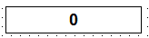
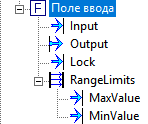
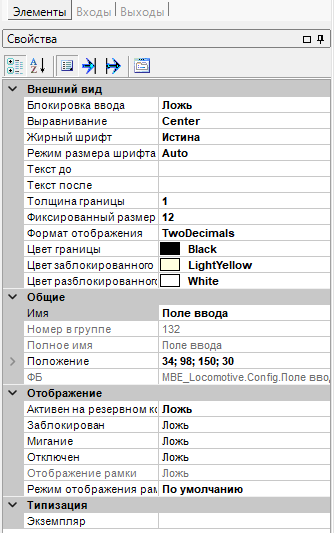

# NumericBox -- Поле ввода числового значения

> **Кратко:** Визуальный ФБ для ввода и отображения числового значения. Поддерживает обратную связь с внешним источником: в Output попадает более новое из двух значений — пользовательский ввод или значение на входе Input. Краткие единичные скачки значения не вызывают ложной отправки. Поддерживает блокировку ввода, диапазонную валидацию с предупреждениями MasterSCADA и настраиваемый формат отображения и вывода.

## 1. Интерфейс

### Входы

| Имя | Тип | Описание |
|-----|-----|----------|
| Input | Вещественный | Внешнее значение (обратная связь от контура управления) |
| Lock | Логический | `true` -- блокировка ввода с визуальной индикацией |

### Группа RangeLimits

| Имя | Тип | Описание |
|-----|-----|----------|
| MaxValue | Вещественный | Верхняя граница допустимого диапазона |
| MinValue | Вещественный | Нижняя граница допустимого диапазона |

Входы MinValue и MaxValue опциональны. Если вход не подключён (нет связи в дереве проекта), соответствующая граница не проверяется вне зависимости от значения.

### Выходы

| Имя | Тип | Описание |
|-----|-----|----------|
| Output | Вещественный | Выходное значение |

### События (предупреждения)

| Имя | Условие |
|-----|---------|
| Значение выше максимума | Output > MaxValue (при подключённом MaxValue) |
| Значение ниже минимума | Output < MinValue (при подключённом MinValue) |
| Минимум превышает максимум | MinValue > MaxValue (при обоих подключённых) |

События активируются и деактивируются автоматически при каждом цикле `UpdateData`. Первые 5 секунд после перехода в режим исполнения события не генерируются.

## 2. Визуальные свойства (окно настроек)

| Свойство | По умолчанию | Описание |
|----------|--------------|----------|
| Цвет границы | SystemColors | Цвет рамки вокруг элемента на мнемосхеме |
| Толщина границы | 1 | Ширина рамки в пикселях (0 = без рамки) |
| Блокировка ввода | false | Принудительная блокировка (дополнительно к входу Lock) |
| Цвет разблокированного | White | Фон текстового поля в разблокированном состоянии |
| Цвет заблокированного | LightYellow | Фон текстового поля в заблокированном состоянии |
| Текст до | (пусто) | Префикс перед числом (например, `T =`) |
| Текст после | (пусто) | Суффикс после числа (например, `°C`) |
| Выравнивание | Left | Горизонтальное выравнивание текста |
| Жирный шрифт | true | Использовать жирное начертание |
| Формат отображения | TwoDecimals | Формат числа (см. ниже) |
| Режим размера шрифта | Auto | Auto -- подбор по высоте, Fixed -- фиксированный размер |
| Фиксированный размер шрифта | 12 | Размер в pt (действует только при режиме Fixed) |

### Форматы отображения (DisplayFormat)

- `NoDecimals` -- целое число
- `OneDecimal` -- 1 знак после запятой
- `TwoDecimals` -- 2 знака после запятой
- `ThreeDecimals` -- 3 знака после запятой

## 3. Валидация при вводе

При подтверждении пользователем введённого значения (нажатие Enter / потеря фокуса):

1. **Распознавание**: попытка распознать число из текста. Точка заменяется на запятую. При ошибке -- диалоговое окно с описанием.
2. **Проверка диапазона**: если подключены входы MinValue / MaxValue, значение проверяется на вхождение в `[min, max]`. При выходе за границу -- диалоговое окно с указанием предела. Значение **отклоняется**, Output не изменяется.
3. **Применение**: при успешной валидации значение передаётся в Output.

Значения, приходящие через вход Input, **не** проверяются диапазоном на уровне валидации. Вместо этого при отклонении от диапазона генерируются предупреждающие события.

