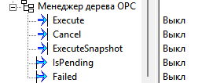
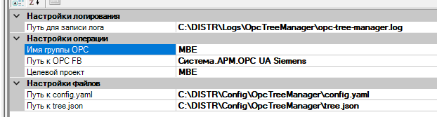

# OpcTreeManager -- Менеджер дерева OPC

> **TL;DR:** Перестраивает поддерево OPC UA FB в дереве проекта MasterSCADA под выбранный целевой проект. За один фронт `Execute` одновременно отключает лишние узлы (с чисткой их связей) и включает недостающие (с восстановлением связей из эталонного `tree.json`). Отдельным фронтом `ExecuteSnapshot` снимает текущее состояние группы в `tree.json` как новый эталон. Планирование -- в Runtime, исполнение -- отложенно в Design mode. Результат -- только в лог-файле.

## 1. Назначение

Используется при мультипроектной работе, когда один большой проект (М-проект, ~1000 тегов) делится на малые проекты (~500 тегов) для отдельных установок. Ручное отключение/включение сотен узлов OPC-группы и восстановление их связей -- трудоёмкая и ломающая операция; ФБ выполняет её детерминированно на основании двух конфигурационных файлов.

## 2. Интерфейс



### Входы

| ID | Имя | Тип | Описание |
|----|-----|-----|----------|
| 1 | Execute | bool | Фронт `0 -> 1` запускает сканирование, формирование плана перестройки группы и постановку в очередь |
| 2 | Cancel | bool | Фронт `0 -> 1` отменяет ожидающий план |
| 3 | ExecuteSnapshot | bool | Фронт `0 -> 1` снимает текущее состояние группы в `tree.json` (операция немедленная, без отложенного исполнения) |

### Выходы

| ID | Имя | Тип | Описание |
|----|-----|-----|----------|
| 101 | IsPending | bool | `true` если план сформирован и ожидает перехода в Design mode |
| 102 | Failed | bool | `true` если последняя операция сканирования или снимка завершилась ошибкой |

### Параметры (окно настроек)



| Свойство | По умолчанию | Описание |
|----------|--------------|----------|
| Целевой проект | `MBE` | Имя проекта из `config.yaml`, определяющее набор «желаемых» узлов группы |
| Путь к OPC FB | `Система.АРМ.OPC UA Siemens` | Полный путь к OPC UA FB в дереве проекта |
| Имя группы OPC | `MBE` | Имя группы внутри `ScadaRootNode` OPC FB, прямые потомки которой управляются |
| Путь к `tree.json` | `C:\DISTR\Config\OpcTreeManager\tree.json` | Эталонный снапшот дерева (используется при Execute и при ExecuteSnapshot) |
| Путь к `config.yaml` | `C:\DISTR\Config\OpcTreeManager\config.yaml` | Маппинг целевых проектов на списки имён узлов |
| Путь для записи лога | `C:\DISTR\Logs\OpcTreeManager\opc-tree-manager.log` | Полный путь к файлу лога |

## 3. Внешние файлы

### 3.1. `tree.json` -- эталонный снапшот группы

Генерируется через `ExecuteSnapshot` на эталонном состоянии проекта (когда все нужные узлы включены и связаны), затем кладётся в контроль версий как канонический. На целевых установках ФБ только **читает** его при `Execute`. Плоская структура: ключ -- имя прямого потомка группы, значение -- `scadaItem` (данные узла для реконструкции) и `links` (внешние связи всего поддерева узла).

```json
{
  "Action": {
    "links": [
      {
        "localPin": "Система.АРМ.OPC UA Siemens.ServerInterfaces.MBE.Action.WaferInRobot",
        "externalPin": "MBE_Locomotive.Транспорт.Setpoint.WaferInRobot",
        "linkType": "iconnect"
      },
      { ... }
    ],
    "scadaItem": { "name": "Action", "id": 2034, "nodeId": "ns=4;i=257", "isNode": false, "pinValueType": "0", ... }
  },
  "Cameras": { ... }
}
```

`linkType` -- один из `iconnect`, `directPin`, `directPout` -- определяет порядок аргументов при вызове `Connect`. Связи дедуплицируются на этапе сбора: если один и тот же внешний пин приходит в обеих масках (non-`$` под `ctIConnect` и `$` под `ctGenericPin` -- близнецы для `PinPout`-пинов), побеждает строка без `$`. Подробнее о `$`-сиблингах -- [KnownIssues/05-opc-command-pin-connect-overload](KnownIssues/05-opc-command-pin-connect-overload.md).

### 3.2. `config.yaml` -- маппинг целевых проектов

Описывает, какие прямые потомки группы входят в какой целевой проект. Имена должны точно совпадать с именами узлов в дереве и с ключами в `tree.json`.

```yaml
projects:
  MBE:
    - Cameras
    - Axes
    - Robot
    - Valves
    - Action
    - Shutters
    - Pumps
    - SCADA
    - ...
  PLASMA:
    - Shutters
    - Vacuummeter
    - Pyrometer
    - ...
```

При `Execute` с целевым проектом `MBE` множество «желаемых» узлов = `[Cameras, Axes, Robot, ...]`. Узлы текущей группы, которых нет в этом множестве, -- к удалению; узлы из множества, которых нет в текущей группе, -- к добавлению из `tree.json`.

## 4. Порядок работы `Execute`

### Runtime

1. Читается `config.yaml`, выбирается список узлов для `TargetProject`.
2. Читается `tree.json`.
3. Сканируется текущая группа в OPC FB: собирается список существующих прямых потомков.
4. Формируется `RebuildPlan`:
   - **Shrink**: для узлов, которых нет в списке `TargetProject` -- план рекурсивно собирает все внешние связи их поддерева (через `LinkCollector`) для последующего отсоединения.
   - **Expand**: для узлов из списка `TargetProject`, которых нет в текущей группе, -- `ExpandSpec` с данными узла и списком связей из `tree.json`.
5. `IsPending = true`.

### Design mode (отложенное исполнение)

6. Таймер (200 мс x 100 попыток = 20 сек) ждёт `!InRuntime`.
7. Как только условие выполнено:
   - Для каждого удаляемого узла -- `Disconnect` всех собранных связей.
   - Собирается новый `group.Items`: существующие узлы, оставшиеся в желаемых, переносятся как есть; недостающие конструируются из `ExpandSpec.ScadaItem`. `group.Items.Clear()`, затем по списку `group.Items.Add(...)`.
   - `protocol.ScadaRootNode = protocol.ScadaRootNode` (сброс внутреннего кэша), `protocol.SynchWihSysTree()`, `opcFbItem.ApplyChange()` -- регистрация новых пинов в реестре проекта.
   - Для свежесобранных узлов -- `Connect` связей из `ExpandSpec.Links`.
8. Итоговая сводка в лог: `shrink=N expand=M; links total=T ok=S fail=F`.

Существующие узлы, которые остаются в группе между двумя Execute, не переподключаются -- их связи переживают swap `group.Items`, а повторный `Connect` на уже занятом слоте бросит исключение. Это логируется в `BuildNewItems` как `preserved 'Name' (links intact, no reconnect)` против `newly constructed 'Name' (N links to reconnect)`.

## 5. Порядок работы `ExecuteSnapshot`

Выполняется немедленно в Runtime, без отложенного исполнения, так как не модифицирует дерево:

1. Сканируется текущая группа.
2. Для каждого прямого потомка собираются все внешние связи поддерева.
3. Результат пишется в `tree.json` по указанному пути.

Используется на эталонном состоянии для создания/обновления канонического `tree.json`. Полученный файл коммитится в репозиторий и распространяется на целевые установки через `Build/Deploy.ps1`.

## 6. Обработка ошибок

### Ошибки валидации (прерывают `Execute`)

| Ситуация | Поведение |
|----------|-----------|
| `tree.json` не найден или не парсится | Ошибка в лог, `Failed = true`, операция отменена |
| `config.yaml` не найден или не парсится | Ошибка в лог, `Failed = true`, операция отменена |
| `TargetProject` не найден в `config.yaml` | Ошибка в лог, `Failed = true`, операция отменена |
| OPC FB не найден по `OpcFbPath` | Ошибка в лог, `Failed = true`, операция отменена |
| Группа `GroupName` не найдена в `ScadaRootNode` | Ошибка в лог, `Failed = true`, операция отменена |
| Все узлы группы уже соответствуют `TargetProject` | Информация в лог, `IsPending = false`, ошибки нет |

### Ошибки исполнения (не прерывают отложенное выполнение)

| Ситуация | Поведение |
|----------|-----------|
| Пин не найден по пути | Ошибка в лог, переход к следующей операции |
| `Disconnect` не удался | Ошибка в лог, переход к следующей связи |
| `Connect` не удался | Ошибка в лог, переход к следующей связи |
| `ApplyChange` не удалось | Ошибка в лог, прерывание текущего плана |

Механизма отката нет -- частично выполненные операции остаются в новом состоянии группы.

## 7. Режим исполнения

MasterSCADA запрещает модификацию дерева проекта в Runtime (`Изменение проекта в режиме исполнения запрещено.`), поэтому:

1. В Runtime: сканирование, формирование плана, `IsPending = true`.
2. В `ToDesign()` -- `FlushPendingPlan()` -- `PostDeferredExecution()` -- таймер (200 мс x 100 попыток).
3. Как только `InRuntime = false`, таймер выполняет план и останавливается.
4. Если 20 секунд `InRuntime` не стал `false`, план не выполняется; сообщение в лог.

> **Важно:** После остановки Runtime не изменяйте дерево проекта вручную ~20 секунд -- таймер может ещё работать.

> **Важно:** Результат отложенного исполнения доступен только в лог-файле. Экземпляр ФБ заменяется между циклами Runtime, поэтому выходные пины `IsPending`/`Failed` отражают только фазу Runtime, не отложенную фазу.

## 8. Логирование

- **Путь:** свойство `LogFilePath`, по умолчанию `C:\DISTR\Logs\OpcTreeManager\opc-tree-manager.log`
- **Ротация:** по размеру 5 МБ, до 5 файлов (суммарно ~25 МБ)
- **Библиотека:** Serilog с `SourceContext` (каждая строка помечена именем модуля: `OpcTreeManagerFB`, `OpcTreeManagerService`, `PlanExecutor`, `DeferredExecutor`, `LinkCollector`)
- **Содержимое:** загрузка конфигов, список узлов к удалению/добавлению, `Disconnect`/`Connect` каждой связи на уровне Debug, сводка на уровне Information
