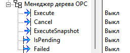
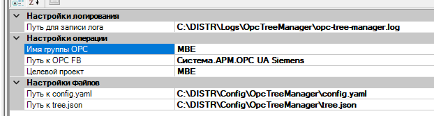

# OpcTreeManager — менеджер дерева OPC

> **Кратко:** компонент выполняет перестроение поддерева OPC UA (FB) в проекте MasterSCADA в соответствии с выбранной конфигурацией. Файл `config.yaml` задаёт требуемую структуру (любой глубины вложенности), а `tree.json` содержит эталонное состояние узлов и их связей.
> По команде `Execute` формируется план изменений: удаляются лишние узлы (с разрывом связей), добавляются отсутствующие (с восстановлением связей), а также ограничивается состав дочерних узлов.
> По команде `ExecuteSnapshot` текущее состояние сохраняется в `tree.json`.
> Сканирование выполняется в режиме исполнения, а само перестроение — отложенно, после перехода в режим разработки. Результаты фиксируются в логе.

---

## 1. Назначение

Компонент предназначен для мультипроектной эксплуатации, когда один крупный проект (порядка 1000 тегов) разделяется на несколько меньших (около 500 тегов) для отдельных установок.

Ручное управление составом OPC-группы (включение/отключение узлов и восстановление их связей) является трудоёмким и подверженным ошибкам процессом. Данный функциональный блок автоматизирует эти операции, выполняя их детерминированно на основе конфигурационных файлов.

---

## 2. Интерфейс



### Входы

| Имя             | Тип  | Описание                                                                |
| --------------- | ---- | ----------------------------------------------------------------------- |
| Execute         | bool | Переход `0 → 1` запускает сканирование и формирование плана перестройки |
| Cancel          | bool | Переход `0 → 1` отменяет сформированный план                            |
| ExecuteSnapshot | bool | Переход `0 → 1` сохраняет текущее состояние группы в `tree.json`        |

### Выходы

| Имя       | Тип  | Описание                          |
| --------- | ---- | --------------------------------- |
| IsPending | bool | Признак наличия отложенного плана |
| Failed    | bool | Признак ошибки последней операции |



### Параметры

| Свойство             | Значение по умолчанию                               | Описание                     |
| -------------------- | --------------------------------------------------- | ---------------------------- |
| Целевой проект       | `MBE`                                               | Имя проекта из `config.yaml` |
| Путь к OPC FB        | `Система.АРМ.OPC UA Siemens`                        | Полный путь к узлу OPC UA FB |
| Имя группы OPC       | `MBE`                                               | Имя управляемой группы       |
| Путь к `tree.json`   | `C:\DISTR\Config\OpcTreeManager\tree.json`          | Эталонный снимок             |
| Путь к `config.yaml` | `C:\DISTR\Config\OpcTreeManager\config.yaml`        | Конфигурация проектов        |
| Путь к логу          | `C:\DISTR\Logs\OpcTreeManager\opc-tree-manager.log` | Файл лога                    |

---

## 3. Внешние файлы

### 3.1. `tree.json` — эталонное состояние

Файл содержит снимок структуры группы и используется как источник для восстановления узлов и связей.

* Формируется через `ExecuteSnapshot`
* При выполнении `Execute` используется только для чтения

Структура:

* ключ — имя узла верхнего уровня
* `scadaItem` — описание узла
* `links` — список внешних связей

Особенности:

* повторяющиеся связи удаляются
* тип связи (`iconnect`, `directPin`, `directPout`) определяет способ подключения

---

### 3.2. `config.yaml` — описание целевых конфигураций

Файл задаёт состав узлов для каждого проекта.

Описывать состав можно двумя способами:

1. **Указать узел без вложенных элементов**
   Узел сохраняется полностью вместе со всем поддеревом.

Например:

```yml
projects:
  MBE:
    - Cameras # Будут использоваться все вложенные элементы в Cameras
```

2. **Узел с дочерними элементами**
   Узел сохраняется, но его дочерние элементы ограничиваются указанным списком.

```yml
projects:
  MBE:
    - Cameras:
      - Camera1 # Будут использоваться только указанные вхождения
      - Camera3 # Отсутствующие в перечислении - будут отброшены
```

Правила:

* вложенность не ограничена

```yml
projects:
  MBE:
    - Cameras:
      - Camera1:
        - Subchamber1
```

* имена должны совпадать с именами в проекте и `tree.json`
* допускается смешивание типов

```yml
projects:
  MBE:
    - Cameras:
      - Camera1:
        - Subchamber1
      - Camera2
```

---

### 3.3. Полнота снимка

Файл `tree.json` должен содержать объединение всех узлов, используемых во всех проектах.

Если узел отсутствует:

* он не будет создан при выполнении
* узел верхнего уровня называется в логе на уровне ошибки при построении плана, а при выполнении
  повторяется на уровне Debug
* вложенный узел план не проверяет, поэтому его называет только запись уровня ошибки при выполнении

При добавлении новых узлов:

1. обновить OPC сервер 
2. выполнить `ExecuteSnapshot`

### 3.4. Ограничения восстановления

Три ограничения текущей реализации.

**Существующий узел не достраивается.** Узел, записанный в `config.yaml` без перечня
потомков, сохраняется без изменений: восстановление не спускается внутрь и не
восстанавливает его связи. Пустая или частично заполненная папка остаётся в прежнем
состоянии. Восстанавливается только узел, отсутствующий целиком. Последовательность
«создать папки вручную, затем выполнить `Execute`» результата не даёт: если имена верхнего
уровня после этого совпали, план не строится вовсе и в журнале появляется запись `Group
'<группа>' top-level node names already match project '<проект>'; no rebuild`.

**Снимок привязан к таблице namespace сервера, с которого снят.** Сохранённые `NodeId`
содержат индекс namespace, являющийся позицией в таблице сервера. При добавлении или
удалении Server Interface индексы смещаются, и восстановленные узлы адресуют другой
namespace: теги остаются серыми, записей об ошибке нет. Снимок пересоздаётся под ту таблицу
namespace, на которой он будет применён.

**Архивирование восстановленных узлов не включается.** Признак `IsHistorySupport` при
восстановлении не заполняется и остаётся ложным у всех узлов. Настройки архивирования по
таким узлам не применяются, сообщений об этом нет. Причина —
[known_issues/15](known_issues/15-derived-properties-as-identity.md).

Пустая целевая группа достижима для поиска, и над ней действуют два отказа:

* `Execute` не строит план, если группа пуста и ни одно имя целевого проекта из `config.yaml`
  не найдено в `tree.json` или записано там без `scadaItem`: восстанавливать нечего,
  `Failed = true`. При частичном совпадении план строится, а каждое ненайденное имя пишется
  в лог на уровне ошибки.
* `ExecuteSnapshot` не записывает снимок пустой группы поверх `tree.json`: снимок без узлов
  эталонным состоянием не бывает. Файл остаётся прежним, `Failed = true`.

## 4. Выполнение `Execute`

### Этап в режиме исполнения

1. Загрузка `config.yaml`
2. Загрузка `tree.json`
3. Построение плана редактирования
4. Установка `IsPending = true`. В случае ошибки или отсутствия изменений `IsPending = false`

---

### Этап в режиме разработки (отложенное выполнение)

1. Ожидание выхода из режима исполнения (до 20 секунд)
2. Применение плана:
   * удаление лишних узлов и связей
   * добавление отсутствующих узлов
   * обновление состава дочерних элементов
3. Применение изменений к OPC серверу
4. Восстановление связей для новых узлов

Особенности:

* изменения применяются рекурсивно
* существующие узлы не переподключаются
* замена состава происходит атомарно на каждом уровне дерева отдельно; отката всего плана при сбое в середине нет — см. раздел 6

---

## 5. Выполнение `ExecuteSnapshot`

Операция выполняется немедленно:

1. Сканируется текущая группа
2. Собираются связи всех узлов
3. Результат записывается в `tree.json`, если в нём есть хотя бы один узел

Отказ на шаге 1 останавливает операцию до записи: `tree.json` остаётся прежним, `Failed = true`.
На этом же шаге отклоняется `OpcFbPath`, который не указывает на узел OPC UA FB, поэтому такой
путь эталонный файл перезаписать не может. Какой путь отклоняется, а какой проходит — раздел 6.

Шаг 3 не выполняется для пустой группы: снимок без узлов эталонным состоянием не бывает,
поэтому `tree.json` остаётся прежним, а `Failed` поднимается.

Отказ срабатывает только на полностью пустой группе. Если в группе остался хотя бы один
узел, снимок из этого узла перезаписывает эталонный файл целиком. Проверки «узлов стало
меньше, чем было» нет: после перестроения, которое убрало узлы, короткий снимок и есть
верный результат. Держите `tree.json` под контролем версий или снимайте копию перед
экспериментами с составом группы.

Используется для формирования эталонного состояния.

---

## 6. Обработка ошибок

### Ошибки валидации (останавливают выполнение)

* отсутствуют или повреждены `config.yaml` / `tree.json`
* не найден целевой проект
* `OpcFbPath` не указывает на узел OPC UA FB: `No OPC UA FB node at path '<путь>'. OpcFbPath must name the OPC UA FB node itself.`
  Одно сообщение на два случая: узла по этому пути нет вовсе либо путь уходит глубже узла. Путь
  разрешается точно, без подъёма к предкам. Отказ срабатывает на сканировании, до первой записи
  в дерево и до записи снимка. Путь к другому узлу OPC UA FB того же проекта проверку проходит:
  отличить его от нужного нечем, и снимок пишется по нему
* узел по `OpcFbPath` найден, но протокол из него не читается: пустой `Instance`, чужой тип
  инстанса или протокола. Это отдельный отказ со своими сообщениями
* не найдена группа
* группа пуста и ни одно имя целевого проекта не найдено в `tree.json` или записано там без
  `scadaItem` (`Execute`)
* группа пуста полностью, поэтому снимок писать нечем (`ExecuteSnapshot`); группа с одним
  оставшимся узлом снимок пишет и перезаписывает `tree.json`
* некорректные параметры

Результат:

* операция отменяется
* `Failed = true`
* запись в лог

---

### Ошибки выполнения (не останавливают процесс)

* не найден вход или выход
* ошибка `Disconnect` / `Connect`
* частичные сбои

Результат:

* ошибка фиксируется в логе
* выполнение продолжается

Откат изменений не предусмотрен. Перестройка при этом доходит до конца и возвращает успех, хотя
узлы остались без части связей. Что с этим делать, говорит итоговая запись: она заканчивается
состоянием дерева и действием оператора (см. 8.2).

### Исключение после начала перестройки

Отдельный случай: отказ или исключение, пойманные уже после первой записи в дерево. Часть узлов
к этому моменту отключена и заменена, часть нет, и привести дерево в согласованное состояние
нечем. В логе это одна запись:

```
Rebuild of group '<группа>' failed after the reshape began; the tree is partially changed,
close the project without saving: <причина>
```

Действие по ней одно: закрыть проект без сохранения. Сохранение зафиксирует наполовину
перестроенное дерево.

---

## 7. Режим работы

Изменение структуры проекта в режиме исполнения запрещено, поэтому используется отложенное выполнение:

1. В режиме исполнения формируется план
2. После перехода в режим разработки выполняется применение
3. Таймер ожидает до 20 секунд
4. При превышении времени выполнение отменяется

Важно:

* после остановки режима исполнения не изменяйте проект вручную в течение ~20 секунд
* результаты доступны только в логе

---

## 8. Логгирование

* **Файл:** задаётся параметром `LogFilePath`
* **Ротация:** по размеру, 5 МБ на файл, удержание 5 файлов
* **Библиотека:** Serilog
* **Строка:** метка времени, уровень, сообщение. Имени класса в строке нет. Если запись несёт
  объект исключения, его текст и стек идут следующими строками
* **Кодировка:** шаблоны сообщений целиком ASCII, связь обозначена как `<->`. Значения приходят
  из проекта и ASCII не ограничены: путь `Система.АРМ.OPC UA Siemens` попадает в файл как есть

Недоступный для записи `LogFilePath` отключает логирование и больше ничего. `WriteTo.File`
перехватывает отказ при создании приёмника и подставляет пустой, поэтому FB работает дальше,
а `Failed` остаётся низким: ни одна операция не сбоила. Файл при этом не создаётся.

### 8.1. Уровни

* **Error** — доменный объект (узел, связь, группа, файл), который не окажется в
  запланированном состоянии, или операция, которая не выполнилась. Строка называет
  идентификаторы этого объекта. Перестройка целиком — такой же доменный объект: итоговая
  запись пишется на уровне Error, когда хоть один её счётчик отличен от нуля, и дублирует по
  уровню ошибки отдельных объектов намеренно. Отложенный этап не может поднять `Failed`
  (см. 8.4), поэтому вердикт о перестройке есть только в этой строке
* **Warning** — факт, который может оставить объект в незапланированном состоянии, и код
  различить этого не может
* **Information** — граница операции: вход в режим исполнения, найденная группа, загрузка и
  запись снимка, план, постановка перестройки в очередь, перестроенный контейнер, завершение
  перестройки без сбоев. Плюс по строке на каждый узел, состав которого изменился
* **Debug** — по строке на связь плюс сохранённые узлы

### 8.2. Содержимое

Режим исполнения:

* вход в режим исполнения со значениями `OpcFbPath`, `GroupName`, `TargetProject`,
  `TreeJsonPath`, `ConfigYamlPath` (Information). Пишется первой, до остальной инициализации,
  чтобы следующая строка имела контекст
* срыв инициализации: `Initialization failed` (Error, с объектом исключения). Отключает ФБ до
  следующего входа в режим исполнения и поднимает `Failed`
* ошибки загрузки конфигурации и снапшота (Error). Успешная загрузка `config.yaml` не
  пишется. Если целевой проект не найден, сообщение перечисляет имена проектов, которые в
  `config.yaml` есть
* путь найденной группы относительно `ScadaRootNode`: `Group '<группа>' resolved at '<путь>' for
  Execute` (Information). `ExecuteSnapshot` пишет ту же строку, но заканчивает её на `for
  ExecuteSnapshot`
* `Snapshot '<файл>' loaded: N nodes, M links, file written <дата>` (Information). Дату даёт
  `File.GetLastWriteTime`; если файловая система её не отдала, вместо даты стоит `unknown`
* связи снимка с пустым путём пина: `Snapshot '<файл>': N links with a blank pin path
  ignored` (Warning)
* план до применения: `Plan for group '<группа>', project '<проект>': remove <имена>;
  construct <имена> (N links under them in the snapshot); preserve <имена>` (Information). Это и
  есть список изменений, по которому решают, применять план или нет. `N` — сколько связей снимок
  держит под этими узлами целиком; если `config.yaml` ограничивает состав потомков, восстановлено
  будет меньше, и с итогами по узлам это число напрямую не сходится
* узел целевого проекта, которого нет ни в группе, ни в снимке: `Node '<имя>' of project
  '<проект>' will not be restored: not in group '<группа>', not in the snapshot; re-capture with
  ExecuteSnapshot or drop it from config.yaml` (Error). Пишется для непустой группы и для пустой,
  в которой нашлась хотя бы часть узлов; если в пустой группе не нашлось ни одного, план
  отклоняется целиком и пишется только отказ
* совпадение состава: `Group '<группа>' top-level node names already match project
  '<проект>'; no rebuild` (Information). Сверяются только имена узлов верхнего уровня
* отмена по входу `Cancel`: `Pending rebuild of group '<группа>' cancelled` (Information)

Отложенный этап:

* постановка в очередь: `Rebuild of group '<группа>' queued; waits for the host to leave
  runtime, timeout 20s` (Information). Единственная запись о том, что FB увидел `ToDesign` с
  готовым планом
* отказ до первой мутации: `Rebuild of group '<группа>' not started, the tree is unchanged:
  <причина>` (Error). Эту же строку пишет исключение, брошенное до перестройки: поиск
  протокола и группы идёт до первой мутации, и совет закрыть проект там был бы вреден
* отказ или исключение после начала перестройки: `Rebuild of group '<группа>' failed after the
  reshape began; the tree is partially changed, close the project without saving: <причина>`
  (Error, с объектом исключения, если он был). Границу между двумя строками задаёт сам
  исполнитель: флаг поднимается на первой записи в дерево — первом `Disconnect` или первой
  замене состава контейнера, — а не на чтениях, которые ей предшествуют. Перестройка, которая
  флаг не подняла, и связей не выдавала: команды на подключение даёт только построенный узел, а
  он появляется только вместе с заменой состава
* срыв таймера: `Rebuild of group '<группа>' abandoned` (Error, с объектом исключения)
* хост не вышел из режима исполнения: `Rebuild of group '<группа>' not started: the host
  stayed in runtime 20s after ToDesign; the plan is discarded` (Error)

Что изменилось, по узлам:

* удаляемый узел: `Removed '<узел>': N disconnects issued, M threw` (Information)
* удаляемый узел, которого в проекте нет: `Remove '<узел>': node not found in the project,
  links not disconnected` (Error). Такой узел считается пропущенным узлом, а не сбойной
  связью, и строки `Removed ...` для него нет: отключать было нечего
* построенный узел: `Constructed '<узел>': N links to connect` (Information)
* построенный узел, которому нечего подключать: `Constructed '<узел>': no links to connect; the
  snapshot holds none under the kept nodes, so the node comes back unwired` (Error). Узел
  восстановлен, но остался без связей: ни одной связи снимок под ним не держит либо все они
  отсеклись ограничением состава потомков из `config.yaml`. Счётчиками связей такой узел не
  виден — до сборки команд ни одна связь не дошла, поэтому у него свой счётчик `noLinks`
* сохранённый узел: `Preserved '<узел>'` (Debug)
* узел, которого нет ни в контейнере, ни в снимке: `Not restored '<узел>': not in the
  container, not in the snapshot`. Для узла верхнего уровня — Debug, потому что тот же факт на
  уровне ошибки уже записан при построении плана. Для вложенного — Error: план сверяет со снимком
  только верхний уровень, поэтому другой записи о нём нет
* контейнер: `Reshaped '<контейнер>': removed=N constructed=N preserved=N skipped=N`
  (Information). Счётчики относятся к одному уровню дерева, не накапливаются по рекурсии.
  Контейнер, состав которого не менялся, такой строки не пишет

Связи:

* итог по узлу: `Node '<узел>': N links, K resolved, U unresolved` (Error). Пишется только
  тогда, когда хоть одна связь не разрешилась в вызов; обе половины счёта относятся к моменту
  сборки команд, до первого вызова вендора, поэтому `K` не обязано совпадать с
  `connects issued=` в итоговой записи. Узел, построенный без связей, сюда не попадает: его
  называет своя строка `Constructed ...: no links to connect` и счётчик `noLinks`
* невыданная связь: `Link not issued, <причина>: <локальный пин> <-> <внешний пин> (<тип>)`
  (Error). Причины: `local pin missing`, `external pin missing`, `unknown link type
  '<тип>'`. Оба конца названы в каждой строке. Строка про внешний пин добавляет, что снимок мог
  устареть или потребитель был переименован
* выданные вызовы: `Connect issued <локальный пин> <-> <внешний пин> (<тип>)` и `Disconnect
  issued <локальный пин> <-> <внешний пин> (<тип>)` (Debug). Число таких строк совпадает с
  `connects issued=` и `disconnects issued=` в итоговых записях: вызов, бросивший исключение,
  выданным не считается
* исключение вендорского вызова: `Connect ... threw` и `Disconnect ... threw` (Error, с
  объектом исключения)

`ExecuteSnapshot`:

* путь найденной группы: `Group '<группа>' resolved at '<путь>' for ExecuteSnapshot`
  (Information)
* по узлу: `Captured '<узел>': N links` (Information). `tree.json` перезаписывается каждым
  снимком, поэтому лог остаётся единственной историей того, что было в снимке раньше
* узел группы, путь которого не разрешился в проекте: `Node '<имя>' captured with no links: '<путь>' did not resolve in the project; the group holds a SCADA item with no item in the project tree`
  (Error). Через `OpcFbPath` сюда приводит только путь к чужому узлу OPC UA FB (раздел 6):
  путь, не указывающий на узел OPC UA FB, отклоняется ещё на сканировании. Такой узел попадает
  в `tree.json` без связей, и снимок перезаписывает единственный эталон
* по связи: `Captured <тип> <локальный пин> <-> <внешний пин>` (Debug)
* захват iconnect-связи через соседний пин: `Iconnect ...: input sibling '<пин>' captured to
  '<путь>'` (Debug) либо `Iconnect ... captured without an input link on '<пин>'` (Warning).
  Вторая строка означает, что входная половина пары не прочиталась; причина и обход —
  [known_issues/11](known_issues/11-opc-pinpout-sibling-and-iconnect-connect.md)
* результат: `Snapshot of group '<группа>' written to '<файл>': N nodes, M links, K without
  links` (Information при `K = 0`). Когда `K` не ноль, та же строка пишется на уровне Error и
  заканчивается на `; the next rebuild constructs those nodes unwired`: узел без связей попал в
  `tree.json`, и следующая перестройка построит его неподключённым. `Failed` при этом остаётся
  низким (см. 8.4)

Итог перестройки — одна запись, и её уровень задают её же счётчики. Когда все они нулевые:

```
Rebuild of group '<группа>' finished without failures: removed=N constructed=N noLinks=N
notRestored=N; disconnects issued=N threw=N nodesMissing=N; connects issued=N threw=N
unresolved=N
```

Когда хоть один из `noLinks`, `notRestored`, `threw`, `nodesMissing`, `unresolved` не нулевой,
та же строка пишется на уровне Error, начинается с `finished with failures:` и заканчивается
состоянием дерева и действием оператора. Счётчики делят это на два случая:

* не разрешились только связи (`unresolved`, `noLinks`): `; the nodes are in the tree with links
  missing, close the project without saving, then re-capture the snapshot or repair the
  consumers`. Разрушительная половина при этом отработала: узлы заменены, старая разводка
  снята, `Execute` вернул успех. Снимок устарел или потребители переехали
* сбоил кто-то ещё (`threw`, `nodesMissing`, `notRestored`, с любыми связями): `; the tree is
  partially rebuilt, close the project without saving`. Что именно не встало на место, называют
  строки Error выше

Сохранение в обоих случаях фиксирует недостроенное дерево. `notRestored` — это те же узлы, что
дали строки `Not restored ...` при перестройке и `... will not be restored` при построении
плана, поэтому ни один такой узел не остаётся без вердикта. Другого признака неуспешной
перестройки нет: `Failed` отложенный этап поднять не может (см. 8.4).

Счётчики отвечают за действия самой перестройки, а не за содержимое снимка. Связь, отброшенную
при загрузке `tree.json` (пустой путь пина), называет только запись `Snapshot '<файл>': N links
with a blank pin path ignored` уровня Warning: до перестройки такая связь не доходит и в
`unresolved` попасть не может. В итог она входит косвенно — через `noLinks`, если из-за неё узел
восстановился без связей.

Диагностика поиска группы:

* при неудачном поиске группы — состав `ScadaRootNode` с именем, `IsNode` и числом
  потомков по каждому узлу, до трёх уровней и до 20 потомков у каждого узла (Error). Узлы,
  скрытые этими двумя ограничениями, отмечены строкой по месту обрыва. Весь дамп ограничен
  200 строками, и если этот предел сработал, в конце добавляется строка с числом узлов,
  отброшенных именно им

### 8.3. Чего в логе нет

Ни одна строка не утверждает, что связь установлена. Подключённая связь читается из того же
процесса как отсутствующая, обратное чтение невозможно; см.
[known_issues/11](known_issues/11-opc-pinpout-sibling-and-iconnect-connect.md). Самое
сильное, что пишется, — `issued`: вызов вендора выполнен и не бросил исключения. То же на
стороне отключения.

### 8.4. Лог и выход `Failed`

`Failed` поднимают три операции режима исполнения: инициализация FB, `Execute` (сканирование
и построение плана) и `ExecuteSnapshot`.

У `ExecuteSnapshot` из этого есть изъятие: узлы, записанные в `tree.json` без связей, `Failed`
не поднимают. Снимок сделан и файл записан, а узел без связей бывает и законным — у него просто
нет потребителей. Отличить его от узла, путь которого не разрешился, может только лог: сам
неразрешившийся путь называет строка `Node '<имя>' captured with no links`, а счётчик `K
without links` в итоговой записи поднимает её уровень до Error. `Failed` остаётся низким, и
смотреть надо в лог.

Отложенная перестройка `Failed` поднять не может. Между циклами исполнения хост заменяет
инстанс FB, и запись в пин после `ToDesign` уходит в выброшенный объект —
[known_issues/07](known_issues/07-fb-instance-replacement.md). Неудачная перестройка
оставляет `Failed = 0` и `IsPending = 0`. Результат отложенного этапа есть только в логе, и
ждать от `Failed` сигнала о плохой перестройке бесполезно.
