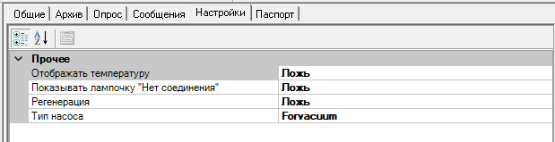
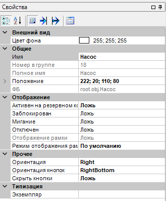
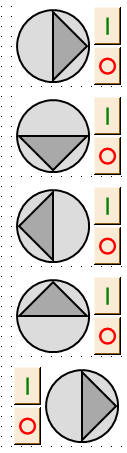
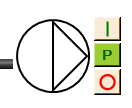

# Pump -- Насос (форвакуумный, турбомолекулярный, ионный, криогенный)

> **Кратко:** Блок управления и отображения вакуумного насоса на мнемосхеме. Принимает от ПЛК слово состояния `StatusWord` и отдаёт слово команд `CommandWord` (Пуск/Стоп). Внешний вид и набор сигналов зависят от свойства «Тип насоса». Для криогенного насоса дополнительно доступно управление регенерацией.

## 1. Интерфейс

### Входы

| Имя         | Тип                      | Описание                                                |
| ----------- | ------------------------ | ------------------------------------------------------- |
| StatusWord  | БеззнаковыйКороткийЦелый | Слово состояния от контроллера (по битам, см. раздел 2) |
| Temperature | Вещественный             | Температура насоса                                      |

### Группа «Типозависимые переменные»

Состав входов группы определяется свойством «Тип насоса»:

| Тип насоса | Входы                         | Описание                      |
| ---------- | ----------------------------- | ----------------------------- |
| Forvacuum  | —                             | Дополнительных входов нет     |
| Turbine    | Speed                         | Скорость, %                   |
| Ion        | Voltage, Current, Power       | Напряжение, ток, мощность     |
| Cryogen    | TemperatureIn, TemperatureOut | Температуры входа и выхода, К |

Вход `Power` (ионный насос) принимается, но в окне параметров не отображается.

### Выходы

| Имя         | Тип                      | Описание                                            |
| ----------- | ------------------------ | --------------------------------------------------- |
| CommandWord | БеззнаковыйКороткийЦелый | Слово команд к контроллеру (по битам, см. раздел 2) |

Группа «Выходы для UI»: каждый бит слова состояния продублирован отдельным логическим выходом, чтобы отдельный признак можно было привязать в дереве проекта напрямую (см. таблицу ниже).

### События (предупреждения)

| Имя                           | Условие                                           |
| ----------------------------- | ------------------------------------------------- |
| Соединение потеряно           | Нет связи с насосом (признак `ConnectionOk` снят) |
| Разгон начат                  | Установлен признак `Accelerating`                 |
| Торможение начато             | Установлен признак `Decelerating`                 |
| Вышел на номинальную скорость | Установлен признак `WorkOnNominalSpeed`           |
| Остановился                   | Установлен признак `Stopped`                      |
| Пользователь запустил         | Оператор нажал «Пуск»                             |
| Пользователь остановил        | Оператор нажал «Стоп»                             |

События о состоянии насоса формируются только когда установлен признак `Used` (насос задействован).

## 2. Вход/выход ФБ

### StatusWord (вход)

| Бит | Имя                           | Значение                                                                                  |
| --- | ----------------------------- | ----------------------------------------------------------------------------------------- |
| 0   | ConnectionOk                  | Связь с насосом в норме                                                                   |
| 1   | MainError                     | Основная ошибка                                                                           |
| 2   | UsedByAutoMode                | Управление от автоматического режима (ручные команды заблокированы)                       |
| 3   | WorkOnNominalSpeed            | Работа в номинальном (рабочем) режиме                                                     |
| 4   | Stopped                       | Остановлен                                                                                |
| 5   | Accelerating                  | Разгон                                                                                    |
| 6   | Decelerating                  | Торможение                                                                                |
| 7   | Warning                       | Предупреждение                                                                            |
| 8   | Message1                      | Сообщение 1 (для ионного насоса — защитный режим)                                         |
| 9   | Message2                      | Сообщение 2                                                                               |
| 10  | Message3 / RegenerationActive | Сообщение 3; в криогенном насосе с включённой регенерацией — признак активной регенерации |
| 11  | Custom                        | Пользовательский признак                                                                  |
| 12  | ForceStop                     | Принудительный останов (запрещает Пуск)                                                   |
| 13  | BlockStart                    | Запрет Пуска                                                                              |
| 14  | BlockStop                     | Запрет Стопа                                                                              |
| 15  | Used                          | Насос задействован                                                                        |

### CommandWord (выход)

| Бит | Имя          | Значение                                                                            |
| --- | ------------ | ----------------------------------------------------------------------------------- |
| 0   | Start        | Пуск                                                                                |
| 1   | Stop         | Стоп                                                                                |
| 2   | Regeneration | Включение регенерации (только криогенный насос со свойством «Регенерация» = истина) |

Команды кратковременные: при нажатии кнопки соответствующий бит слова команд на короткое время устанавливается в истину и затем сбрасывается.

## 3. Свойства (окно настроек)

Тип насоса и отображаемые элементы задаются на вкладке «Настройки»:

| Свойство                             | По умолчанию | Описание                                                                              |
| ------------------------------------ | ------------ | ------------------------------------------------------------------------------------- |
| Тип насоса                           | Forvacuum    | Тип насоса (см. ниже); задаёт внешний вид, набор типозависимых входов и текст событий |
| Показывать лампочку "Нет соединения" | false        | Показ лампочки «Нет соединения» в окне параметров                                     |
| Отображать температуру               | false        | Показ температуры в окне параметров                                                   |
| Регенерация                          | false        | Включает кнопку «P» управления регенерацией (действует только для криогенного насоса) |

Поворот значка и расположение кнопок задаются в общих свойствах блока:

| Свойство          | По умолчанию | Описание                                                              |
| ----------------- | ------------ | --------------------------------------------------------------------- |
| Скрыть кнопки     | false        | Скрывает блок кнопок управления, оставляя только значок насоса        |
| Ориентация        | Right        | Поворот значка насоса (Right / Bottom / Left / Top)                   |
| Ориентация кнопок | RightBottom  | Расположение блока кнопок относительно значка (RightBottom / LeftTop) |

### Тип насоса (PumpType)

- `Forvacuum` — форвакуумный насос
- `Turbine` — турбомолекулярный насос
- `Ion` — ионный насос
- `Cryogen` — криогенный насос

## 4. Работа

В режиме исполнения блок разбирает слово состояния на отдельные признаки и обновляет цвет значка и доступность кнопок.

**Кнопки управления.** По умолчанию показаны две кнопки: «I» (Пуск) и «O» (Стоп). Нажатие подаёт соответствующую кратковременную команду в слово команд. Кнопки «Пуск» и «Стоп» становятся недоступными:

- в автоматическом режиме (признак `UsedByAutoMode`);
- «Пуск» — при запрете Пуска (`BlockStart`) или принудительном останове (`ForceStop`);
- «Стоп» — при запрете Стопа (`BlockStop`).

**Значок насоса.** Цвет отражает состояние: рабочий режим, останов, разгон, торможение, отсутствие данных. Рамка ошибки появляется при основной ошибке, при потере связи или при неопределённом состоянии (когда не установлен ни один из признаков рабочего режима, останова, разгона или торможения); рамка предупреждения — при активном предупреждении. Обе рамки показываются только когда насос задействован (признак `Used`). Признак блокировки появляется не при любом запрете, а в соответствующем состоянии: запрет Пуска или принудительный останов — при остановленном или тормозящем насосе; запрет Стопа — при работе на номинальной скорости или разгоне. Положение значка и блока кнопок зависит от свойств «Ориентация» и «Ориентация кнопок».

**Окно параметров.** Открывается удержанием правой кнопки мыши на значке. В верхней строке показывает текущее состояние, ниже — набор ламп и измеряемые значения, зависящие от типа насоса и включённых свойств.

Лампы:

- «Ошибка», «Предупреждение» — всегда;
- «Блокировка запуска», «Блокировка остановки», «Принудительная остановка» — всегда;
- «Нет связи» — только при включённом свойстве «Показывать лампочку "Нет соединения"»;
- «Защитный режим» — только для ионного насоса (признак `Message1`).

Измеряемые значения:

- «Температура» — только при включённом свойстве «Отображать температуру»;
- «Скорость», % — турбомолекулярный насос;
- «Напряжение», В и «Ток», А — ионный насос;
- «Т1», К и «Т2», К (температуры входа и выхода) — криогенный насос.

### Строка состояния в окне параметров

Текст состояния зависит от типа насоса:

| Условие                      | Forvacuum     | Turbine       | Ion           | Cryogen              |
| ---------------------------- | ------------- | ------------- | ------------- | -------------------- |
| Признак `Accelerating`       | разгон        | разгон        | охлаждение    | повышение напряжения |
| Признак `Decelerating`       | замедление    | замедление    | нагрев        | выключение           |
| Признак `WorkOnNominalSpeed` | рабочий режим | рабочий режим | рабочий режим | рабочий режим        |
| Признак `Stopped`            | остановлен    | остановлена   | остановлен    | остановлен           |
| Иное сочетание признаков     | не определено | не определено | не определено | не определено        |

При отсутствии связи или когда насос не задействован показывается «нет данных».

## 5. Регенерация (криогенный насос)

Возможность доступна только при «Тип насоса» = `Cryogen` и свойстве «Регенерация» = истина. В этом случае между кнопками «Пуск» и «Стоп» появляется кнопка «P».

- **Команда.** Нажатие «P» подаёт кратковременную команду включения регенерации (бит 2 слова команд). В автоматическом режиме (`UsedByAutoMode`) нажатие не выполняется.
- **Подсветка.** Цвет кнопки «P» отражает признак активной регенерации (бит 10 слова состояния): жёлто-зелёный — регенерация идёт, светло-бежевый — регенерации нет. Цвет показывается всегда, в том числе в автоматическом режиме.

Свойство «Регенерация» по умолчанию выключено: ранее настроенные криогенные насосы отображаются без кнопки «P», а бит 2 слова команд остаётся равным «ложь». У остальных типов насосов кнопка не появляется.

> Примечание: при переключении свойства «Регенерация» в окне свойств кнопка «P» появляется или скрывается после изменения размера элемента на мнемосхеме либо повторного открытия мнемосхемы.
