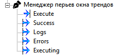

# TrendPensManager -- Управление перьями графиков

> **TL;DR:** По команде Execute очищает все перья в открытом окне тренда и заново добавляет их на основе структуры сервисов под `DataRootPath`. Для сервисов БКТ, БП, БУЗ имена перьев берутся из ConfigLoader. Для остальных -- имя пера = имя параметра. Обрабатываются только каналы с `Used == true`. Окно тренда должно быть открыто.



## 1. Интерфейс

### Входы

| ID | Имя | Тип | Описание |
|----|-----|-----|----------|
| 1 | Execute | bool | Фронт `0 -> 1` запускает автонастройку |

### Выходы

| ID | Имя | Тип | Описание |
|----|-----|-----|----------|
| 10 | Executing | bool | `true` во время выполнения |
| 11 | Success | bool | `true` на 1 сек после полного успеха |
| 12 | Logs | string | Лог выполнения (перезаписывается при каждом запуске) |
| 13 | Errors | string | Ошибки (пусто при успехе) |

### Параметры (окно настроек)

#### Пути в дереве

| Свойство | По умолчанию | Описание |
|----------|--------------|----------|
| Путь к корню трендов | `PLZ_Inject.Графики` | Объект тренда, в окно которого добавляются перья |
| Путь к загрузчику конфигурации | `PLZ_Inject.Config.Загрузчик конфигурации` | Блок ConfigLoader в дереве |
| Путь к корню сервисов | `PLZ_Inject.Графики` | Корень, под которым расположены сервисы (источник данных) |

#### Включение/исключение сервисов

| Свойство | По умолчанию | Имя сервиса в дереве |
|----------|--------------|----------------------|
| Добавлять БКТ | `true` | `БКТ` |
| Добавлять БП | `true` | `БП` |
| Добавлять БУЗ | `true` | `БУЗ` |
| Добавлять Вакуумметры | `true` | `Вакуумметры` |
| Добавлять Пирометр | `true` | `Пирометр` |
| Добавлять Турбины | `true` | `Турбины` |
| Добавлять Крио | `true` | `Крио` |
| Добавлять Ионные | `true` | `Ионные` |
| Добавлять Интерферометр | `true` | `Интерферометр` |
| Добавлять Газы | `true` | `Газы` |

Если флаг `false` -- сервис полностью пропускается. Все флаги отключены -- не ошибка, просто ни одного пера не добавится.

## 2. Структура данных в дереве

### Поддерево сервисов (под DataRootPath)

```text
DataRootPath/
├── БКТ
│   ├── Канал1
│   │   ├── T1 (pin)
│   │   ├── P1 (pin)
│   │   └── Used (bool pin)
│   └── Канал2
│       └── ...
├── БП
│   └── ...
├── БУЗ
│   └── ...
├── Вакуумметры
│   └── ...
├── Пирометр
│   └── ...
└── Газы
    └── ...
```

**Требования:**
- Первый уровень -- объекты сервисов (имена должны точно совпадать с таблицей выше).
- Второй уровень -- каналы. Имя канала должно заканчиваться цифрой (например `Канал1`, `Channel_3`); цифровой суффикс = номер канала.
- Каждый канал обязан содержать пин `Used` (bool). Отсутствие `Used` -- критическая ошибка.
- Остальные пины канала -- параметры для перьев.
- `Used == false` -- канал пропускается (не ошибка).

### Связь с ConfigLoader

Имена из ConfigLoader используются **только для БКТ, БП, БУЗ**:

| Тип сервиса | Группа ConfigLoader | Размер |
|-------------|---------------------|--------|
| БКТ (Heaters) | `Sources_OUT[1..32]` | 32 |
| БП (ChamberHeaters) | `ChamberHeaters_OUT[1..16]` | 16 |
| БУЗ (Shutters) | `Shutters_OUT[1..16]` | 16 |
| Газы | `Gases_OUT[1..16]` | 16 |

Номер канала = индекс в массиве ConfigLoader. Выход за границы массива -- критическая ошибка.

Для остальных сервисов (Вакуумметры, Пирометр, Турбины, Крио, Ионные, Интерферометр) имена из ConfigLoader не используются.

## 3. Именование перьев

### Для БКТ, БП, БУЗ, Газы

```text
<ИмяПараметра> <ИмяИзКонфига>
```

Примеры: `T1 Источник верхний`, `P1 Нагреватель камеры 2`.

Если `<ИмяИзКонфига>` пустое, имя пера = только `<ИмяПараметра>`.

### Для остальных сервисов

Имя пера = `<ИмяПараметра>` (без суффикса из ConfigLoader).

## 4. Алгоритм работы

1. **Валидация:** проверка путей `TrendRootPath`, `ConfigLoaderRootPath`, `DataRootPath` и наличия соответствующих узлов в дереве.
2. **Обход сервисов:** сканирование `DataRootPath`, фильтрация по флагам `Add...`, сбор каналов и параметров.
3. **Чтение ConfigLoader:** получение массивов имён для БКТ, БП, БУЗ, Газы.
4. **Построение последовательности перьев:** для каждого канала с `Used == true` формируется список перьев с именами.
5. **Применение к тренду:**
   - Поиск открытого окна тренда по `TrendRootPath`.
   - **Очистка всех существующих перьев** в окне тренда.
   - Добавление новых перьев из построенной последовательности.
   - Для каждого пера: установка пользовательского имени и стиля отображения "ступенькой".

**Критично:** Окно тренда для `TrendRootPath` должно быть открыто. Если окно закрыто -- ошибка.

## 5. Обработка ошибок

### Критические ошибки (прерывают операцию)

| Ситуация | Поведение |
|----------|-----------|
| Любой из путей пуст или узел не найден | `Errors` содержит описание, перья не добавляются |
| Отсутствует пин `Used` в канале | `Errors` содержит описание, перья не добавляются |
| Группа ConfigLoader не найдена или пин отсутствует | `Errors` содержит описание, перья не добавляются |
| Номер канала выходит за границы массива ConfigLoader | `Errors` содержит описание, перья не добавляются |
| Окно тренда не открыто | `Errors` содержит описание, перья не добавляются |

### Ошибки добавления отдельных перьев (не прерывают операцию)

| Ситуация | Поведение |
|----------|-----------|
| Пин не найден, нет прав, сбой добавления | Ошибка накапливается, остальные перья продолжают обрабатываться |

При наличии хотя бы одной ошибки добавления `Success` не поднимается, `Errors` содержит сводку.

## 6. Поведение выходов

| Фаза | Executing | Success | Logs | Errors |
|------|-----------|---------|------|--------|
| На фронт Execute | `true` | сброс в `false` | очистка | очистка |
| Успешное завершение | `false` | `true` на 1 сек | полный лог | пусто |
| Завершение с ошибкой | `false` | `false` | полный лог | описание ошибок |

## 7. Особенности поведения

- **Деструктивная работа:** при каждом запуске все существующие перья в тренде удаляются и создаются заново.
- **Нет отката:** если часть перьев добавлена успешно, а часть с ошибкой -- успешно добавленные остаются.
- **Повторный запуск:** `Logs` и `Errors` перезаписываются. Список перьев формируется заново по текущему состоянию дерева.
- **Предел перьев:** за один запуск добавляется не более 1000 перьев в один тренд.
