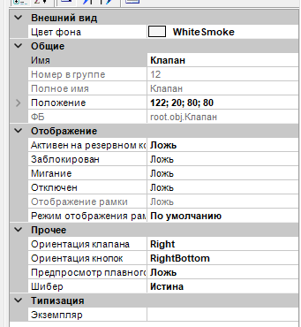
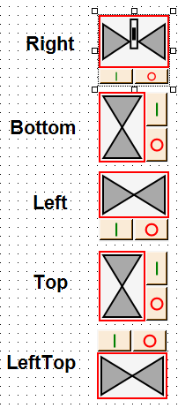
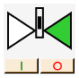
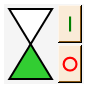

# Valve -- Клапан (обычный, плавный, шибер, ручной, без датчиков)

> **Кратко:** Блок управления и индикации клапана на мнемосхеме. Принимает от контроллера слово состояния `StatusWord` и отдаёт слово команд `CommandWord` (Открыть / Плавно открыть / Закрыть). Внешний вид зависит от свойства «Шибер» и признаков состояния (плавный, ручной, без датчиков положения).

## 1. Интерфейс

### Входы

| Имя        | Тип                      | Описание                                                |
| ---------- | ------------------------ | ------------------------------------------------------- |
| StatusWord | БеззнаковыйКороткийЦелый | Слово состояния от контроллера (по битам, см. раздел 2) |

### Выходы

| Имя         | Тип                      | Описание                                            |
| ----------- | ------------------------ | --------------------------------------------------- |
| CommandWord | БеззнаковыйКороткийЦелый | Слово команд к контроллеру (по битам, см. раздел 2) |

Группа «Выходы для UI»: каждый бит слова состояния продублирован отдельным логическим выходом, 
чтобы отдельный признак можно было привязать в дереве проекта напрямую.

### События (предупреждения)

| Имя                     | Условие                                                                     |
| ----------------------- | --------------------------------------------------------------------------- |
| Коллизия концевиков     | Сработали оба датчика положения (признак `Collision`)                       |
| Не открылся             | Нет подтверждения открытия (признак `NotOpened`)                            |
| Не закрылся             | Нет подтверждения закрытия (признак `NotClosed`)                            |
| Открылся                | Признак `Opened`                                                            |
| Плавно открылся         | Признак `SmoothlyOpened`                                                    |
| Закрылся                | Признак `Closed`                                                            |
| Пользователь открыл     | Оператор нажал «Открыть»                                                    |
| Пользователь плавно открыл | Оператор нажал «Плавно открыть»                                          |
| Пользователь закрыл     | Оператор нажал «Закрыть»                                                    |

События формируются только для задействованного клапана (признак `Used`). Ошибки положения
(коллизия, не открылся, не закрылся) не формируются у клапана без датчиков положения (признак `WithoutSensors`).

## 2. Слово состояния и слово команд

### StatusWord (вход)

| Бит | Имя            | Значение                                                            |
| --- | -------------- | ------------------------------------------------------------------ |
| 0   | ConnectionOk   | Связь с клапаном в норме                                            |
| 1   | NotOpened      | Нет подтверждения открытия от датчика положения                     |
| 2   | NotClosed      | Нет подтверждения закрытия от датчика положения                     |
| 3   | Collision      | Коллизия концевиков (сработали оба датчика положения одновременно)  |
| 4   | UsedByAutoMode | Управление от автоматического режима (ручные команды заблокированы) |
| 5   | Opened         | Открыт                                                              |
| 6   | SmoothlyOpened | Открыт плавно                                                       |
| 7   | Closed         | Закрыт                                                              |
| 8   | OpeningClosing | В движении (открывается или закрывается)                            |
| 9   | Used           | Клапан задействован                                                 |
| 10  | Manual         | Ручной клапан (управляется вручную, кнопки не показываются)         |
| 11  | WithoutSensors | Без датчиков положения (ошибки положения не формируются)            |
| 12  | ForceClose     | Принудительное закрытие (запрещает открытие)                        |
| 13  | BlockClosing   | Запрет закрытия                                                     |
| 14  | BlockOpening   | Запрет открытия                                                     |
| 15  | IsSmoothValve  | Клапан с плавным открытием (доступна кнопка плавного открытия)      |

Когда одновременно активны `NotOpened` и `NotClosed`, состояние считается неопределённым
(в окне параметров — лампа «Неопределённое состояние»).

### CommandWord (выход)

| Бит | Имя          | Значение       |
| --- | ------------ | -------------- |
| 0   | Open         | Открыть        |
| 1   | OpenSmoothly | Плавно открыть |
| 2   | Close        | Закрыть        |

Команды кратковременные: при нажатии кнопки соответствующий бит слова команд на короткое время
устанавливается в истину и затем сбрасывается.

## 3. Свойства (окно настроек)

| Свойство                     | По умолчанию | Описание                                                                                     |
| ---------------------------- | ------------ | -------------------------------------------------------------------------------------------- |
| Ориентация клапана           | Right        | Поворот значка (Right / Bottom / Left / Top); поворот на 90° меняет местами ширину и высоту  |
| Ориентация кнопок            | RightBottom  | Расположение блока кнопок относительно значка (RightBottom / LeftTop)                         |
| Шибер                        | false        | Отображать клапан как шибер. Имеет приоритет над плавным клапаном                             |
| Предпросмотр плавного клапана | false       | Показ плавного клапана в режиме разработки. В режиме исполнения тип берётся из признака `IsSmoothValve` |

### Ориентация клапана (Orientation)

- `Right` — вправо
- `Bottom` — вниз
- `Left` — влево
- `Top` — вверх

### Ориентация кнопок (ButtonOrientation)

- `RightBottom` — справа (для горизонтального клапана — снизу)
- `LeftTop` — слева (для горизонтального клапана — сверху)

## 4. Работа

В режиме исполнения блок разбирает слово состояния на отдельные признаки и обновляет вид значка
и доступность кнопок.

**Кнопки управления.** «I» (зелёная) — открыть, «O» (красная) — закрыть. У клапана с плавным
открытием между ними появляется кнопка плавного открытия. Нажатие подаёт соответствующую
кратковременную команду в слово команд. Доступность:

- «Открыть» и «Плавно открыть» — недоступны в автоматическом режиме (`UsedByAutoMode`), при
  запрете открытия (`BlockOpening`) или принудительном закрытии (`ForceClose`);
- «Закрыть» — недоступна в автоматическом режиме или при запрете закрытия (`BlockClosing`).

Блок кнопок полностью скрыт у ручного клапана (признак `Manual`) и у незадействованного
(признак `Used` снят). Значок клапана отображается только когда клапан задействован.

 

**Внешний вид значка.** Зависит от свойства «Шибер» и признаков состояния:

- обычный клапан — по умолчанию;
- плавный клапан — признак `IsSmoothValve` (или «Предпросмотр плавного клапана» в режиме разработки);
- ручной клапан — признак `Manual`;
- шибер — свойство «Шибер» (имеет приоритет над плавным);
- шибер без датчиков — свойство «Шибер» вместе с признаком `WithoutSensors`.

Цвет значка отражает состояние: открыт, закрыт, в движении, нет данных. При неисправности вокруг
значка появляется рамка ошибки: при потере связи, а для клапана с датчиками — также при сбоях
положения (не открылся, не закрылся, коллизия, неопределённое состояние). У клапана без датчиков
положения сбои положения не индицируются.

**Окно параметров.** Открывается удержанием правой кнопки мыши на значке. Показывает лампы:

- «Открыт», «Закрыт» — текущее положение;
- «Блокировка открытия», «Блокировка закрытия», «Принудительное закрытие» — по соответствующим признакам;
- «Нет связи» — при потере связи;
- «Не открылся», «Не закрылся», «Неопределённое состояние», «Коллизия концевиков» — появляются при соответствующих неисправностях.
