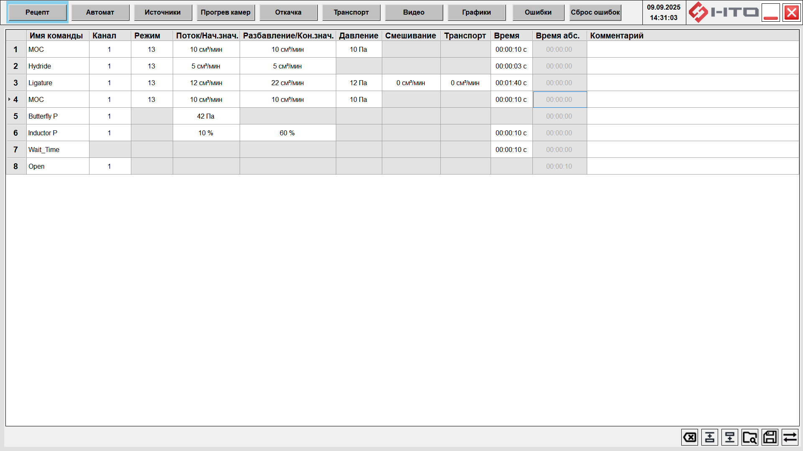

# ФБ "Таблица рецептов MBE" (MbeTableFB)

**MbeTableFB** — это функциональный блок для MasterSCADA 3.12, предназначенный для создания, управления и исполнения технологических рецептов. 



## Оглавление

1.  [Ключевые возможности](#ключевые-возможности)
2.  [Требования к окружению](#требования-к-окружению)
3.  [Установка и первоначальная настройка](#установка-и-первоначальная-настройка)
4.  [Интеграция и внешнее взаимодействие](#интеграция-и-внешнее-взаимодействие)
    *   [Пины функционального блока (FB Pins)](#пины-функционального-блока-fb-pins)
    *   [Взаимодействие с ПЛК по Modbus TCP](#взаимодействие-с-плк-по-modbus-tcp)
    *   [Импорт/Экспорт рецептов в CSV](#импортэкспорт-рецептов-в-csv)
5.  [Конфигурация через YAML-файлы](#конфигурация-через-yaml-файлы)
    *   [Обзор и порядок загрузки](#обзор-и-порядок-загрузки)
    *   [1. `PropertyDefs.yaml` — Словарь типов данных](#1-propertydefsyaml--словарь-типов-данных)
    *   [2. `PinGroupDefs.yaml` — Карта аппаратных средств](#2-pingroupdefsyaml--карта-аппаратных-средств)
    *   [3. `ColumnDefs.yaml` — Структура таблицы рецептов](#3-columndefsyaml--структура-таблицы-рецептов)
    *   [4. `ActionsDefs.yaml` — Словарь команд (действий)](#4-actionsdefsyaml--словарь-команд-действий)
6.  [Диагностика](#диагностика)

---

## Ключевые возможности

*   **Гибкая настройка:** Вся бизнес-логика, структура таблицы и набор команд определяются в текстовых YAML-файлах.
*   **Динамический интерфейс:** Пользовательский интерфейс таблицы (столбцы, редакторы, выпадающие списки) генерируется на основе конфигурации.
*   **Мониторинг в реальном времени:** Отслеживание исполнения рецепта, подсветка текущего шага и расчет оставшегося времени до конца шага и рецепта.
*   **Интеграция с ПЛК:** Прямое взаимодействие с контроллерами по протоколу Modbus TCP для записи параметров рецепта.
*   **Динамическое создание пинов:** Автоматическое создание пинов для связи с оборудованием на основе `PinGroupDefs.yaml`.

## Требования к окружению

*   **SCADA:** MasterSCADA 3.12
*   **Framework:** .NET Framework 4.8

## Установка и первоначальная настройка

1.  **Скопируйте библиотеку** `NtoLib.dll` (и сопутствующие зависимости) в папку `Extensions` вашей установки MasterSCADA.
2.  **Зарегистрируйте сборку.** Откройте командную строку от имени администратора и выполните команду для регистрации библиотеки:
    ```sh
    netreg.exe NtoLib.dll /showerror
    ```
3.  **Создайте папку конфигурации.** В корневой директории проекта MasterSCADA создайте папку `NtoLibTableConfig`.
4.  **Разместите конфигурационные файлы.** Поместите в созданную папку четыре файла: `PropertyDefs.yaml`, `PinGroupDefs.yaml`, `ColumnDefs.yaml`, `ActionsDefs.yaml`.
5.  **Перезапустите среду разработки** MasterSCADA.
6.  **Добавьте ФБ на схему** в вашем проекте.

---

## Интеграция и внешнее взаимодействие

### Пины функционального блока (FB Pins)

Пины служат для связи ФБ с другими элементами проекта MasterSCADA в реальном времени.

#### Входные пины (Inputs)

*   `RecipeActive` (ID: 1, Тип: Логический)
    *   При `true` переводит таблицу в режим исполнения: блокируется редактирование. При `false` возвращает таблицу в режим редактирования.

*   `ActualLineNumber` (ID: 3, Тип: Целый)
    *   Принимает номер текущей исполняемой строки рецепта (начиная с 0). Таблица использует это значение для визуальной индикации. Значение по умолчанию: `-1`.

*   `StepCurrentTime` (ID: 4, Тип: Вещественный)
    *   Принимает от ПЛК время в секундах, прошедшее с начала выполнения текущего шага.

*   `ForLoopCount1`, `ForLoopCount2`, `ForLoopCount3` (ID: 5, 6, 7, Тип: Целый)
    *   Принимают текущий номер итерации для вложенных циклов `FOR`.

*   `EnaSend` (ID: 8, Тип: Логический)
    *   Разрешение на отправку данных в ПЛК. Если `false`, отправка блокируется. По умолчанию `true`.

#### Выходные пины (Outputs)

*   `TotalTimeLeft` (ID: 101, Тип: Вещественный)
    *   Расчетное общее время в секундах до конца выполнения всего рецепта.

*   `LineTimeLeft` (ID: 102, Тип: Вещественный)
    *   Расчетное время в секундах до конца выполнения текущего шага.

### Взаимодействие с ПЛК по Modbus TCP

Модуль предназначен для двунаправленной связи с ПЛК для загрузки рецепта и его верификации.

#### Настраиваемые свойства FB для связи

Все параметры подключения настраиваются в свойствах ФБ `MbeTableFB` в MasterSCADA:

*   `UControllerIp1` - `UControllerIp4`: IP-адрес ПЛК.
*   `ControllerTcpPort`: TCP-порт для подключения (стандартно 502).
*   `UControlBaseAddr`: Начальный адрес **Контрольной области**.
*   `UIntBaseAddr`, `UIntAreaSize`: Начальный адрес и размер (в регистрах) **Области Int**.
*   `UFloatBaseAddr`, `UFloatAreaSize`: Начальный адрес и размер (в регистрах) **Области Float**.
*   **Word Order** (Порядок слов): В текущей версии используется фиксированный порядок HighLow.

#### Память ПЛК

В области плк память должна быть размечена следующим образом:

```ascii

+-------------------------------------------------------------+
| КОНТРОЛЬНАЯ ОБЛАСТЬ (UControlBaseAddr)                      |
|-------------------------------------------------------------|
| R0: Валидация (69) | R1: Кол-во строк | R2-R9: Резерв       |
+-------------------------------------------------------------+
                              
                              ...
                              
+-------------------------------------------------------------+
| ОБЛАСТЬ INT ДАННЫХ (UIntBaseAddr)                           |
|-------------------------------------------------------------|
| [Все Int-значения для всех строк рецепта идут подряд...]    |
|                                                             |
+-------------------------------------------------------------+

                              ...

+-------------------------------------------------------------+
| ОБЛАСТЬ FLOAT ДАННЫХ (UFloatBaseAddr)                       |
|-------------------------------------------------------------|
| [Все Float-значения для всех строк рецепта идут подряд...]  |
| (Каждое Float значение занимает 2 регистра)                 |
+-------------------------------------------------------------+

```

**1. Контрольная область (Control Area)**
*   **Назначение:** Хранение метаданных и проверка связи.
*   **Начальный адрес:** `UControlBaseAddr`.
*   **Размер:** 10 регистров.

| Смещение от `UControlBaseAddr` | Регистр | Назначение                                                                                                    |
| :----------------------------- | :------ | :-------------------------------------------------------------------------------------------------------------- |
| **+0**                         | **R0**  | **Регистр валидации.** Должен содержать константу `69` для проверки корректности связи.                          |
| **+1**                         | **R1**  | **Количество строк рецепта.** Модуль записывает сюда общее число шагов.                                        |
| +2 ... +9                      | R2-R9   | Зарезервировано.                                                                                              |

**2. Область целочисленных данных (Int Area)**
*   **Назначение:** Хранение `Int` параметров рецепта.
*   **Начальный адрес:** `UIntBaseAddr`.
*   **Размер:** `UIntAreaSize`. Должен вмещать `количество_строк * количество_int_параметров_на_строку` регистров.

**3. Область вещественных данных (Float Area)**
*   **Назначение:** Хранение `Float` параметров рецепта.
*   **Начальный адрес:** `UFloatBaseAddr`.
*   **Размер:** `UFloatAreaSize`.
*   **Важно:** Каждое `float` значение занимает **2 регистра Modbus (32 бита)**.

#### Процесс отправки и верификации

Модуль реализует надежный механизм `SendAndVerify`:
1.  **Проверка вместимости:** Расчет требуемого объема памяти.
2.  **Подключение к ПЛК:** Установка соединения и проверка регистра валидации (значение по адресу `UControlBaseAddr` должно быть равно `69`).
3.  **Запись в ПЛК:** Отправка данных с автоматической разбивкой на пакеты.
4.  **Пауза:** Задержка в 200 мс, чтобы ПЛК успел обработать данные.
5.  **Чтение из ПЛК:** Полное считывание данных обратно.
6.  **Верификация:** Сравнение отправленного и считанного рецептов поле за полем.

### Импорт/Экспорт рецептов в CSV

Модуль поддерживает сохранение и загрузку рецептов в формате `.csv` (кодировка **UTF-8 with BOM**).

#### Структура файла

*   **Блок метаданных:** Строки в начале файла, начинающиеся с `#`. Содержат служебную информацию для проверки целостности.
*   **Блок данных:** Стандартный CSV-формат (заголовок + строки данных).

#### Пример файла

```csv
# SEP=;
# ROWS=3
# BODY_SHA256=hFh0A79U9dIXrt3lcxHud6W5rJwTE6EmBmuTIuwmYs0=
# X_ExportedAtLocalTime=2025-09-18T17:31:55+03:00
action;channel;mode;initial_value;final_value;pressure;mixing;transport;step_duration;comment
200;1;1;0;0;0;0;0;0;
200;1;1;32;44;333;321;123;123;коммент
100;1;1;10;10;10;;;10;
```

#### Процесс импорта (чтения)

При загрузке `.csv` файла происходит многоуровневая валидация:
1.  **Проверка метаданных:** Сверяются разделитель (`SEP`), количество строк (`ROWS`) и хеш-сумма (`BODY_SHA256`).
2.  **Проверка совместимости:** Проверяется, что все используемое в рецепте оборудование (например, клапаны, датчики) существует в текущей конфигурации `PinGroupDefs.yaml`.

---

## Конфигурация через YAML-файлы

### Обзор и порядок загрузки

Модуль использует 4 YAML-файла. Порядок загрузки и валидации строгий:
1.  `PropertyDefs.yaml`
2.  `ColumnDefs.yaml` (проверяются ссылки на `PropertyDefs`)
3.  `PinGroupDefs.yaml`
4.  `ActionsDefs.yaml` (проверяются ссылки на все остальные файлы)

### 1. `PropertyDefs.yaml` — Словарь типов данных

*   **Назначение:** Определяет базовые типы данных, их ограничения и форматирование.

*   **Пример:**
    ```yaml
    - property_type_id: "Temp"      # Уникальный ID. Используется в ColumnDefs и ActionsDefs.
      system_type: "System.Single"  # Тип в .NET. Допустимы: System.Single, System.Int32, System.String.
      units: "°C"                   # Единицы измерения (информационно, в логике не участвуют).
      min: 0                        # Минимально допустимое значение.
      max: 2000                     # Максимально допустимое значение.
      format_kind: "Auto"           # Формат отображения: Auto, Scientific, TimeHms.
    ```

### 2. `PinGroupDefs.yaml` — Карта аппаратных средств

*   **Назначение:** Описывает оборудование и связывает его с диапазонами пинов. В UI и CSV значения ID для элементов группы нумеруются с 1.

*   **Пример:**
    ```yaml
    - group_name: "Valve"           # Уникальное имя. Используется в ActionsDefs.
      pin_group_id: 450           # Уникальный ID группы узлов в дереве ФБ.
      first_pin_id: 451           # ID первого пина в группе.
      pin_quantity: 32            # Количество пинов.
    ```

### 3. `ColumnDefs.yaml` — Структура таблицы рецептов

*   **Назначение:** Полное описание каждого столбца в таблице.

*   **Пример:**
    ```yaml
    - key: "initial_value"            # Уникальный ключ столбца.
      business_logic:
        property_type_id: "Float"     # Ссылка на ID из PropertyDefs.yaml.
        read_only: false              # false - столбец можно редактировать, true - нельзя.
        plc_mapping:                  # Опциональная секция для отправки в ПЛК.
          area: "Float"               # Область памяти ПЛК ("Int", "Float").
          index: 0                    # Смещение (индекс) внутри области для данной строки.
      ui:
        code: "initial_value"         # Код для заголовка в CSV.
        ui_name: "Поток/Нач.знач."    # Заголовок столбца в таблице.
        column_type: "property_field" # Тип UI-элемента.
        width: 160                    # Ширина в пикселях (-1 = авто).
        alignment: 32                 # Выравнивание (16=Left, 32=Center, 64=Right).
    ```

*   **Обязательные столбцы:** Для корректной работы системы в файле должны быть определены столбцы с ключами: `action`, `step_duration`, `step_start_time` и `comment`.

### 4. `ActionsDefs.yaml` — Словарь команд (действий)

*   **Назначение:** Определяет доступные пользователю команды.

*   **Пример:**
    ```yaml
    - id: 1100                    # Уникальный числовой ID действия.
      name: "Open"                # Имя для выпадающего списка.
      deploy_duration: "Immediate"  # Тип длительности: Immediate (мгновенное) или LongLasting (длительное).
      columns:
        - key: "channel"
          property_type_id: "Enum"
          group_name: "Valve"       # Связь с группой из PinGroupDefs.yaml
        - key: "comment"
          property_type_id: "String"
    ```

## Диагностика

*   **`debug_logger.txt`**: Лог-файл, который создается автоматически рядом с библиотекой `NtoLib.dll` (обычно в папке `Extensions`). В него записываются все ключевые операции и ошибки.