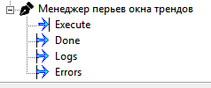

# TrendPensManager — Управление перьями графиков



Функциональный блок автоматически формирует последовательность перьев и добавляет их в окно трендов на основе структуры дерева MasterSCADA и данных из ConfigLoader.

---

## 1. Основные возможности

- Обход сервисов под корнем `TrendRootPath` (БКТ, БП, БУЗ и другие).
- Автоматическое добавление перьев для каналов с `Used == true`.
- Именование перьев по данным из ConfigLoader (для БКТ, БП, БУЗ).
- Сохранение существующих перьев (только добавление новых).
- Логирование всех операций и ошибок.

**Критично:** Окно "Тренд" для `TrendRootPath` должно быть открыто во время выполнения блока.

---

## 2. Интерфейс

### Входы (Pin)

**Execute** (bool)  
Положительный фронт `0 → 1` запускает цикл обработки:
- валидация входных параметров и структуры дерева;
- чтение выходов ConfigLoader и проверка размерностей;
- построение последовательности перьев;
- применение последовательности к открытому окну тренда.

### Выходы (Pout)

**Executing** (bool)  
Устанавливается в `true` на время выполнения операции автонастройки.  
После завершения (успех или ошибка) устанавливается в `false`.

**Success** (bool)  
Устанавливается в `true` на 1 секунду после **полного успешного завершения** операции:
- нет структурных ошибок;
- нет ошибок чтения ConfigLoader и несоответствий размерностей;
- все операции добавления перьев в окно тренда выполнены без ошибок SCADA.

При любой ошибке `Success` не поднимается.

**Logs** (string)  
Строка логов выполнения. Перезаписывается при каждом запуске.  
Содержит информационные сообщения, отладочные сообщения и предупреждения.

**Errors** (string)  
Строка ошибок. Перезаписывается при каждом запуске.  
Содержит только критические ошибки:

- ошибки валидации входных путей;
- ошибки структуры дерева (включая отсутствие `Used`);
- ошибки чтения/размерностей ConfigLoader;
- ошибки, возвращённые SCADA при добавлении перьев (нет пина, нет прав, сбои AddParametr, отсутствие настроек пера и т.д.).

При отсутствии ошибок `Errors` — пустая строка.

### Параметры (окно настроек)

**ConfigLoaderPath** (string)  
Путь к блоку ConfigLoader в дереве MasterSCADA.  
Формат: `PLZ_Inject.Config.Загрузчик конфигурации` (через точку, пробелы не экранируются).

**TrendRootPath** (string)  
Путь к объекту "Графики" (корень сервиса трендов), для которого выполняется автонастройка.

---

## 3. Структура данных в дереве

### 3.1. Поддерево сервисов

```text
TrendRootPath (объект "Графики")
├── БКТ
│   ├── Канал1
│   │   ├── T1 (pin)
│   │   ├── P1 (pin)
│   │   └── Used (bool pin)
│   └── Канал2
│       ├── T1
│       ├── P1
│       └── Used
├── БП
│   └── Канал_1
│       ├── T1
│       └── Used
└── БУЗ
    └── Chanel1
        ├── T1
        └── Used
```

**Требования к структуре:**

- Первый уровень под `TrendRootPath` — объекты сервисов (например: `БКТ`, `БП`, `БУЗ` и прочие).
- Второй уровень — каналы сервиса (например: `Канал1`, `Channel_3`).
- Название канала должно заканчиваться цифрой (например: `Канал1`, `Channel_3`); эта цифра используется как номер канала.
- В каждом канале обязательно присутствует параметр `Used` (bool-пин).  
  Отсутствие `Used` считается **ошибкой структуры**.
- Остальные пины канала рассматриваются как параметры канала (тип не проверяется).
- Если `Used == false` — канал пропускается (перья для него не добавляются), но это не является ошибкой.

### 3.2. Связь с ConfigLoader

Блок использует массивы выходов ConfigLoader для именования перьев:

| Тип сервиса | Массив ConfigLoader       | Размер массива | Индексация                       |
|-------------|---------------------------|----------------|----------------------------------|
| БКТ         | `Sources_OUT[1..32]`      | 32             | Номер канала = индекс массива   |
| БП          | `ChamberHeaters_OUT[1..16]` | 16          | Номер канала = индекс массива   |
| БУЗ         | `Shutters_OUT[1..16]`     | 16             | Номер канала = индекс массива   |
| Прочие      | —                         | —              | Имена из ConfigLoader не используются |

**Жёсткие требования:**

- Для сервисов типов БКТ, БП, БУЗ:
    - Группы `Sources_OUT`, `ChamberHeaters_OUT`, `Shutters_OUT` должны существовать в ConfigLoader.
    - Внутри каждой группы должны существовать пины `1..N` (где `N` = фиксированному размеру массива).
    - Группа не должна быть полностью пустой (все значения не должны быть одновременно пустыми).
- Первое обнаруженное несоответствие (отсутствие группы, пина, полностью пустая группа и т.п.) считается **критической ошибкой**. В этом случае:
    - последовательность перьев не строится;
    - перья в тренд не добавляются;
    - `Errors` содержит описание ошибки;
    - `Success` остаётся `false`.

**Критично:** Номер канала (например, `5` в `Канал5`) должен соответствовать валидному индексу в массиве ConfigLoader.  
Выход за границы массива для типов БКТ, БП, БУЗ — **критическая ошибка**.

---

## 4. Правила именования перьев

### Для БКТ, БП, БУЗ

Формат имени пера:

```text
<ИмяПараметра> <ИмяИзКонфига>
```

**Примеры:**

- `T1 Источник верхний`
- `P1 Нагреватель камеры 2`
- `T2 Заслонка левая`

где:

- `<ИмяПараметра>` — имя пина параметра канала (`T1`, `P1`, `T2` и т.д.).
- `<ИмяИзКонфига>` — строка из соответствующего массива ConfigLoader.

Если для указанного сервиса нет данных ConfigLoader или индекс канала выходит за пределы массива — это считается **ошибкой конфигурации** и выполнение прерывается (см. раздел 5).

### Для остальных сервисов

Для сервисов с типом `Other` (не БКТ, БП, БУЗ):

- Имя пера не изменяется.
- Используется только имя параметра (`<ИмяПараметра>`).

---

## 5. Алгоритм работы

### Шаг 1: Валидация входных данных

1. Проверка, что строки `ConfigLoaderPath` и `TrendRootPath` не пустые.
2. Поиск узлов в дереве проекта:
    - Узел `TrendRootPath` (корень трендов).
    - Узел `ConfigLoaderPath` (блок ConfigLoader).
3. Если любой из узлов не найден — критическая ошибка.

При критической ошибке:

- `Executing` кратковременно переходит в `true` на время попытки и затем в `false`.
- `Success = false`.
- `Errors` содержит описание проблемы.
- `Logs` содержит подробный лог.
- Перья не добавляются.

### Шаг 2: Проверка структуры дерева сервисов

1. Сканирование **первого уровня** дочерних узлов под `TrendRootPath` как сервисов.
2. Для каждого сервиса:
    - Перебор дочерних узлов как каналов.
    - Определение номера канала по цифровому суффиксу имени.
    - Поиск пина `Used` (регистронезависимо).
    - Чтение значения `Used` (преобразование из bool/int/double/других типов).
3. Для каждого канала:
    - Если пин `Used` отсутствует или его невозможно прочитать — **структурная ошибка**, выполнение прерывается.
    - При `Used == true` — канал включается в последовательность обработки.
    - При `Used == false` — канал игнорируется без ошибки.
    - Все остальные пины канала (кроме `Used`) включаются в список параметров.

По итогам формируется объект `TraversalData`:

- `Channels` — список каналов (с `Used == true` и `Used == false`).
- `Warnings` — немасштабные предупреждения (например, особые нестандартные конструкции, не влияющие на корректность).

При любой структурной ошибке:

- `AutoConfigurePens` возвращает ошибку.
- Перья не добавляются.

### Шаг 3: Чтение ConfigLoader и проверка размерностей

1. По заданному `ConfigLoaderPath` находится блок ConfigLoader.
2. Для каждого поддерживаемого сервиса (БКТ, БП, БУЗ) читаются группы:
    - `Sources_OUT[1..32]`,
    - `ChamberHeaters_OUT[1..16]`,
    - `Shutters_OUT[1..16]`.
3. Для каждой группы:
    - Проверяется существование узла группы.
    - Проверяется наличие каждого пина `1..N`.
    - Получается строковое значение пина.
    - Проверяется, что группа не полностью пустая (есть хотя бы одно непустое значение).

**Критические ошибки:**

- Группа не найдена.
- Отсутствует любой из обязательных пинов `1..N`.
- Группа полностью пустая.

При критической ошибке:

- `AutoConfigurePens` возвращает ошибку.
- Перья не добавляются.

Номер канала интерпретируется как индекс массива `1..N`:

- Если номер канала для БКТ, БП, БУЗ выходит за пределы соответствующего массива — **критическая ошибка**, выполнение останавливается.

---

## 6. Построение последовательности перьев

На основе:

- списка каналов (`Channels`) из TraversalData,
- словаря массивов имён из ConfigLoader (`Dictionary<ServiceType, string[]>`),

формируется объект `PenSequenceData`:

- `Sequence` — последовательность элементов `PenSequenceItem`:
    - `SourcePinPath` — полный путь к пину параметра;
    - `TrendPath` — путь к корню трендов;
    - `PenDisplayName` — сформированное имя пера.
- `Warnings` — предупреждения (если есть, не являются критическими).

**Правила:**

- Каналы с `Used == false` в последовательность не включаются.
- Для сервисов типов БКТ, БП, БУЗ:
    - Для каждого канала обязательно должно существовать имя в массиве ConfigLoader по индексу `ChannelNumber`.
    - Отсутствие данных для типа сервиса или выход индекса за пределы массива — критическая ошибка.
- Для сервисов типа `Other`:
    - Имена из ConfigLoader не используются;
    - Имя пера = имя параметра.

**Поведение:**

- При первом обнаруженном критическом несоответствии (конфликт размерностей, отсутствующие данные) построение прекращается, возвращается ошибка, последовательность перьев не применяется.

---

## 7. Применение последовательности к тренду

1. По `TrendRootPath` находится объект тренда.
2. Через сервис трендов находится открытое окно тренда, соответствующее этому объекту.
    - Если окно не открыто — ошибка «Trend window is closed».
3. Перед добавлением перьев:
    - Устанавливается предел по количеству параметров (`MaxParameters = 1000`).
4. Для каждого элемента последовательности:
    - По `SourcePinPath` находится пин.
    - Проверяются права на добавление пера.
    - Выполняется добавление пера методом SCADA (`AddParametr` или аналог).
    - Для добавленного пера определяется его настройка и обновляется отображаемое имя пользователя (`UserName`).

**Ошибки SCADA:**

Для каждого пера могут возникнуть следующие ошибки:

- Пин не найден.
- Нет прав на добавление пера.
- Окно тренда не инициализировано или не поддерживает добавление.
- Метод добавления (`AddParametr`) вернул ошибку или null.
- Не удалось найти настройки пера в коллекции настроек тренда.

Все такие ошибки:

- Накопительно добавляются в список ошибок.
- Логируются как ошибки.
- Не прерывают обработку последовательности (следующие элементы продолжают обрабатываться).

**Итоговое поведение:**

- Если список ошибок добавления перьев непустой:
    - `AutoConfigurePens` возвращает ошибку.
    - `Success` не поднимается.
- Если все перья добавлены без ошибок:
    - `AutoConfigurePens` возвращает успех.
    - В FB поднимается `Success` на 1 секунду.

Предупреждения (например, пропущенные неиспользуемые каналы) не влияют на итоговый статус и не попадают в `Errors`, но отражаются в `Logs` и в `Warnings` результата.

---

## 8. Поведение выходов блока

### Перед стартом выполнения (на фронт Execute):

- `Executing` устанавливается в `true`.
- `Success` принудительно сбрасывается в `false`.
- `Logs` очищается.
- `Errors` очищается.

### При успешном завершении:

- `Executing` устанавливается в `false`.
- `Success` устанавливается в `true` на 1 секунду, затем автоматически сбрасывается в `false`.
- `Logs` содержит полную историю выполнения.
- `Errors` — пустая строка.

### При завершении с ошибкой:

- `Executing` устанавливается в `false`.
- `Success` остаётся `false`.
- `Logs` содержит подробный лог.
- `Errors` содержит одну или несколько ошибок, объединённых по разделителю (формат зависит от реализации; в текущей реализации — `|` между сообщениями).

---

## 9. Особенности поведения

- **Неразрушающая работа:**  
  Существующие перья не удаляются и не модифицируются. Блок добавляет только новые перья.

- **Проверка дубликатов:**  
  Выполняется средствами SCADA. Блок не реализует свою логику проверки дубликатов и опирается на поведение `AddParametr`.

- **Отсутствие отката:**  
  Нет механизма отката при частичной ошибке. Если некоторые перья были успешно добавлены, они остаются в тренде даже при наличии ошибок для других перьев.

- **Повторный запуск:**  
  При каждом запуске:
    - `Logs` и `Errors` перезаписываются.
    - Последовательность строится заново по текущему состоянию дерева и ConfigLoader.
    - Добавление перьев производится с учётом уже существующих настроек тренда (поведение при дубликатах — согласно SCADA).
