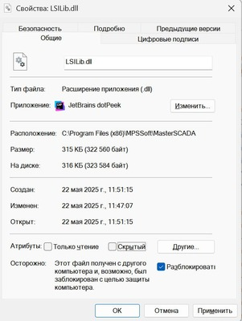
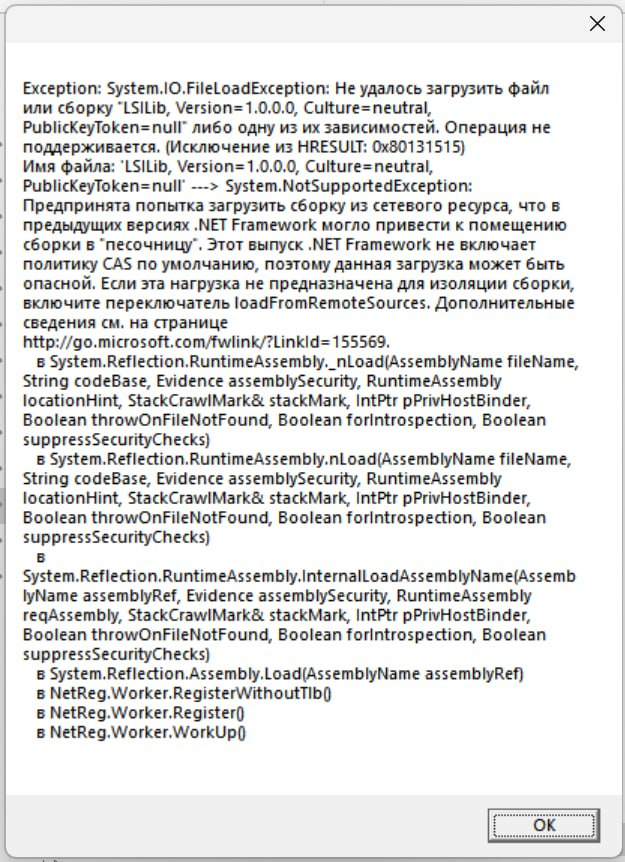
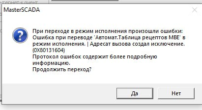

# NtoLib

Библиотека пользовательских функциональных блоков и инфраструктуры для **MasterSCADA 3.12** (.NET Framework 4.8),
ориентированная на поддержку сложных технологических установок (эпитаксия плазмохимия и смежные системы).

## Структура репозитория

### Библиотека NtoLib 

- Каталог: `NtoLib`
- Описание: исходный код NtoLib.dll. Подробную документацию на функционал библиотеки смотри по [ссылке](./NtoLib/readme.md).

### Тесты

- Каталог: `Tests/`
- Содержит проект `Tests` (пространство имён `NtoLib.Test`) для тестирования NtoLib. Состоит из интеграционных и юнит-тестов для разных сценариев использования библиотеки.

### Сборка

Сборка, тесты и создание распространяемого архива выполняются через скрипты [NUKE](https://nuke.build/) из проекта `build/`. См. [документацию](./build/readme.md) по сборке.

## Развёртывание в MasterSCADA

1. Собранный релизный архив распаковать и скопировать `NtoLib.dll` и `System.Resources.Extensions.dll` в каталог установки MasterSCADA.
2. Сопутствующие конфигурационные файлы отдельных блоков поместить в `C:\DISTR\Config`, если не указано иное в документации конкретного блока.
3. Зарегистрировать библиотеку через `NtoLib_reg.bat` или `netreg.exe`.
4. Перезапустить MasterSCADA и добавить нужные функциональные блоки в проект.

## FAQ

### При запуске проекта возникает неизвестная ошибка с указанием GUID блока и/или сам блок не отображается

Нужно проверить что Windows разрешил запуск всех dll, распакованных из архива, см скриншот ниже:

Необходимо разблокировать файлы.

### При выполнении регистрации COM-объекта с NetReg (запуск NtoLib_reg.bat) возникает ошибка как ниже: 

Причина та же, смотри пункт про разблокировку файла.

### При переходе на экран с блоком или при старте проекта возникает ошибка перехода (с не SCADA ошибкой), как на скриншоте:

Возможно произошла ошибка сборки и не все зависимые dll были запакованы в NtoLib.dll в процессе работы Nuke. Можно проверить открыв NtoLib.dll с помощью [dotPeek](https://www.jetbrains.com/decompiler/) прямо в папке MasterScada и посмотреть есть ли битые References.
